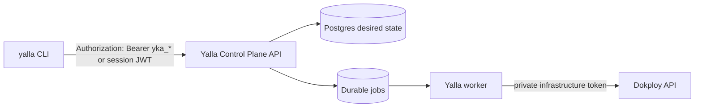

# CLI backend command parity

This matrix tracks the backend-only CLI migration. Normal user-facing commands
must call the Yalla Control Plane API with `Authorization: Bearer <Yalla token>`.
The CLI must not require a Dokploy URL or Dokploy token.

| CLI command | Previous behavior | Target Yalla API route | Auth action / policy | Worker job type | Output schema | Migration status |
| --- | --- | --- | --- | --- | --- | --- |
| `auth login` | Verified Dokploy `user-get` with `x-api-key` | `GET /v1/me` | `auth.me` | none | `authLoginDoc` | migrated |
| `auth status` | Local config/keyring inspection | local-only | none | none | `authStatusDoc` | migrated terminology |
| `auth whoami` | Verified Dokploy identity | `GET /v1/me` | `auth.me` | none | `authLoginDoc` | migrated |
| `auth logout` | Remove stored token | local-only | none | none | `authLogoutDoc` | migrated terminology |
| `api operations` | Embedded Dokploy OpenAPI registry | `GET /openapi.json` | public discovery | none | `apiOperationsDoc` | migrated |
| `schema list` | Embedded Dokploy schemas | `GET /openapi.json` | public discovery | none | `schemaListDoc` | migrated |
| `schema get` | Embedded Dokploy schema by operationId | `GET /openapi.json` then local lookup | public discovery | none | OpenAPI-derived schema doc | migrated |
| `api call <operationId>` | Raw Dokploy operation executor | none for normal users | unsupported | none | `E_UNSUPPORTED` | removed from normal CLI |
| `project list/get/create/update/delete/restore` | not available as product commands | `/v1/projects` and `/v1/projects/{project_id}` | `project.read/create/update/delete/restore` | create/update none; delete/restore backend job when returned | backend `project` / `projects` payload | added |
| `environment list/get/create/update/delete/clone` | not available as product commands | `/v1/projects/{project_id}/environments`, `/v1/environments/{environment_id}`, `/v1/environments/{environment_id}/clone` | `environment.read/create/update/delete/clone` | create/update none; delete/clone backend job when returned | backend `environment` / `environments` payload | added |
| `service list/get/create/update/delete/restore` | not available as product commands | `/v1/environments/{environment_id}/services`, `/v1/services/{service_id}` | `service.read/create/update/delete/restore` | `service.provision`, `service.delete`, or backend job when returned | backend `service` / `services` payload | added |
| `service build get/set` | not available | `/v1/services/{service_id}/build-config` | `service.build.read` / `service.build.update` | `service.build.update` | backend `build_config` payload | added |
| `service deploy` | not available as canonical service command | `POST /v1/services/{service_id}/deployments` | `deployment.create` | `service.deploy` | backend `deployment` payload | added |
| `deploy compose` | Direct Dokploy project/env/compose/domain orchestration | `POST /v1/services/{service_id}/deployments` | `deployment.create` | `service.deploy` | backend `data` passthrough | migrated to service deployment |
| `wait job` | not available | `GET /v1/jobs/{job_id}` | `job.read` | none | backend `job` payload | added |
| `wait deployment` | not available | `GET /v1/deployments/{deployment_id}` | `deployment.read` | none | backend `deployment` payload | added |
| `wait url` | Local HTTP polling | local-only external probe | none | none | URL status doc | retained local utility |
| `wait compose` | Polled Dokploy compose state | none | unsupported | none | command removed | removed |
| `wait orphans` | Polled Dokploy orphan state | none | unsupported | none | command removed | removed |
| `teardown project` | Direct Dokploy cascade/delete | `DELETE /v1/projects/{project_id}` | `project.delete` | `project.delete` | backend `data` passthrough | migrated |
| `rescue orphans` | Direct Dokploy/Docker cleanup or SSH fallback | future backend admin diagnostics | admin break-glass | admin reconciliation | `E_UNSUPPORTED` | disabled |
| `database list` | Direct Dokploy database search | `GET /v1/environments/{environment_id}/services` filtered to `kind=database` | `service.read` | none | backend `services` payload | migrated |
| `database create` | Direct Dokploy database create | `POST /v1/environments/{environment_id}/services` with `kind=database`; optional deployment | `service.create` / `deployment.create` | `ensure_database_service`; optional `service.deploy` | backend `service` / `deployment` payload | migrated for backend-supported Postgres database service |
| `database deploy` | Direct Dokploy database deploy | `POST /v1/services/{service_id}/deployments` | `deployment.create` | `service.deploy` | backend `deployment` payload | migrated |
| `database delete` | Direct Dokploy database remove | `DELETE /v1/services/{service_id}` | `service.delete` | `service.delete` | backend `service` payload | migrated |
| `database backup list` | Direct Dokploy backup list | `GET /v1/services/{service_id}/backups` | `backup.read` | none | backend `backups` payload | migrated |
| `database backup create` | Direct Dokploy backup create | `POST /v1/services/{service_id}/backups` | `backup.create` | none until scheduled/manual run | backend `backup` payload | migrated |
| `database backup update` | Direct Dokploy backup update | `PATCH /v1/services/{service_id}/backups/{backup_id}` | `backup.update` | none until scheduled/manual run | backend `backup` payload | migrated |
| `database backup run` | Direct Dokploy manual backup | `POST /v1/services/{service_id}/backups/{backup_id}/run` | `backup.run` | `run_backup` | backend `backup` payload | migrated |
| `database backup restore` | Direct Dokploy backup restore | `POST /v1/services/{service_id}/backups/{backup_id}/restore` | `backup.restore` | `restore_backup` | backend `backup` payload | migrated |
| `database backup delete` | Direct Dokploy backup delete | `DELETE /v1/services/{service_id}/backups/{backup_id}` | `backup.delete` | none | backend `backup` payload | migrated |
| `audit tail` | Local JSONL audit tail | local-only | none | none | local lines | retained local diagnostic |
| `config get/set` | Local config file | local-only | none | none | config docs | migrated terminology |
| `manifest` | Local command manifest | local-only | none | none | `yalla.manifest.v1` | retained |
| `docs markdown` | Local docs generation | local-only | none | none | markdown/file list | retained |
| `completion <shell>` | Local shell completion | local-only | none | none | shell script | retained |
| `upgrade` | Release/update checks | release metadata endpoints | none | none | upgrade docs | retained |

## Guardrails

- `internal/cli` tests fail if normal CLI code imports `internal/dokploy`.
- Backend request tests assert `Authorization: Bearer ...` and no `x-api-key`.
- Raw Dokploy operation execution returns `E_UNSUPPORTED` in backend-only mode.
- Database service and backup commands use backend service/deployment/backup
  routes; rescue remains disabled until audited admin routes exist.
- Backend desired-state mutations now enqueue durable worker jobs for
  service/domain/variable/backup side effects in the same database transaction.

## Backend side-effect coverage

| Backend mutation | Durable job type | Coverage |
| --- | --- | --- |
| Project deletion scheduling | `project.delete` | enqueued by `ProjectService.ScheduleDeletion` |
| Environment deletion scheduling | `environment.delete` | enqueued by `EnvironmentService.ScheduleDeletion` |
| Service creation with build config | `service.provision` | persisted in `services` and `service_build_configs` before provisioning |
| Service build config update | `service.build.update` | enqueued by `ServiceBuildConfigService.SetServiceBuildConfig` |
| Service deletion scheduling | `service.delete` | enqueued by `ServiceService.ScheduleDeletion` |
| Service domain create/update/delete | `sync_domains` | enqueued by `ServiceDomainService` |
| Service variable replacement | `sync_variables` | enqueued by `ServiceVariableService` |
| Backup manual run | `run_backup` | enqueued by `ServiceBackupService.Run` |
| Backup restore | `restore_backup` | enqueued by `ServiceBackupService.Restore` |

## Remaining Admin Gap

- Any future rescue/admin diagnostic command must be backend-mediated,
  policy-checked, audited, allowlisted, and break-glass gated where required.
