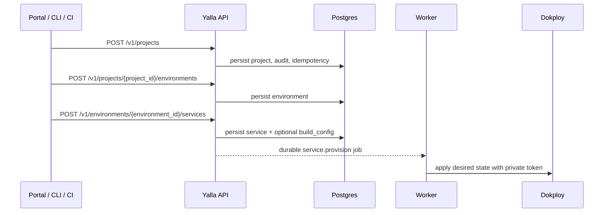

# Yalla Control Plane frontend handoff API guide

Use this guide when building a frontend, CLI workflow, mobile client, or
external integration against the Yalla Control Plane API. It documents the
stable contracts every consumer must rely on so clients and backend can ship
independently.

## Scope

The public API surface is versioned under `/v1`. Admin operations live under
`/v1/admin`. The backend boundary remains:

```text
Customer / Agent / CI / Frontend
  -> Yalla Control Plane API
  -> Postgres source of truth
  -> Provisioning worker
  -> private Dokploy API
```

Frontend code must never call Dokploy directly. All tenant identity, scoped
grants, desired state, durable jobs, audit events, limits, and metered usage are
owned by Yalla.

The CLI follows the same boundary. `yalla auth login` verifies `GET /v1/me`,
`yalla api operations` and `yalla schema` consume `/openapi.json`, and mutating
CLI commands use the same product routes as the frontend rather than raw
Dokploy operation IDs.

## Base URL and versioning

| Environment | Base URL                                 |
|-------------|------------------------------------------|
| Local       | `http://localhost:8080/v1`               |
| Staging     | `https://<redacted:STAGING_HOST>/v1`     |
| Production  | `https://<redacted:PRODUCTION_HOST>/v1`  |

All public endpoints are prefixed with `/v1`. Admin endpoints are prefixed with
`/v1/admin`. Version bumps are coordinated through the release checklist; the
frontend should not hard-code paths outside the `/v1` prefix.

## Authentication

The API accepts two authentication schemes:

1. **Yalla API key** — `Authorization: Bearer yka_...`
2. **Session / JWT bearer token** — `Authorization: Bearer <session_token>`

Frontend sessions should use the JWT bearer scheme. API keys are intended for
CI, agents, and machine-to-machine integrations. Never store API keys in
client-side bundles or localStorage; use secure, httpOnly cookies for session
tokens.

## Stable JSON envelopes

Every response is wrapped in a stable envelope.

### Success envelope

```json
{
  "schema_version": "yalla.output.v1",
  "ok": true,
  "request_id": "req_...",
  "data": {}
}
```

### Error envelope

```json
{
  "schema_version": "yalla.error.v1",
  "ok": false,
  "request_id": "req_...",
  "error": {
    "code": "E_STABLE_CODE",
    "message": "Human readable message.",
    "hint": "Optional recovery hint."
  }
}
```

Frontend code must parse `schema_version` defensively and should treat unknown
versions as a signal to check for backend release notes. The `request_id` field
must be surfaced in user-visible error UI so support can trace the failure.

## Resource hierarchy

Yalla mirrors Dokploy hierarchy with stable IDs:

```text
Organization  -> org_...
  Project     -> proj_...
    Environment -> env_...
      Service   -> svc_...
```

All endpoints that operate on a child resource require the parent IDs in the
path or query. Frontend routing should nest screens using the same hierarchy.

### Stable ID prefixes

| Resource            | Prefix    |
|---------------------|-----------|
| Organization        | `org_`    |
| User                | `usr_`    |
| Membership          | `mem_`    |
| Service account     | `sa_`     |
| API key             | `key_`    |
| Project             | `proj_`   |
| Environment         | `env_`    |
| Service             | `svc_`    |
| Deployment          | `dep_`    |
| Job                 | `job_`    |
| Dokploy ref         | `dref_`   |
| Audit event         | `aud_`    |
| Quota reservation   | `quota_`  |
| Drift finding       | `drift_`  |
| Plan                | `plan_`   |
| Subscription        | `sub_`    |
| Usage counter       | `usage_`  |
| Metering sample     | `meter_`  |
| Billing export      | `bill_`   |
| Config set          | `cfg_`    |
| Feature flag        | `flag_`   |
| Policy              | `policy_` |

## Project, Environment, And Service Contract

The portal, CLI, and CI agents all use the same product routes. Creating a
project in one surface must immediately make it manageable from the other
surface.



Primary routes:

| Resource | Routes |
| --- | --- |
| Projects | `GET/POST /v1/projects`, `GET/PATCH/DELETE /v1/projects/{project_id}`, `POST /v1/projects/{project_id}/restore` |
| Environments | `GET/POST /v1/projects/{project_id}/environments`, `GET/PATCH/DELETE /v1/environments/{environment_id}`, `POST /v1/environments/{environment_id}/clone` |
| Services | `GET/POST /v1/environments/{environment_id}/services`, `GET/PATCH/DELETE /v1/services/{service_id}`, `POST /v1/services/{service_id}/restore` |
| Build config | `GET/PUT /v1/services/{service_id}/build-config` |
| Deployments | `POST /v1/services/{service_id}/deployments` |

Service create accepts an optional `build_config` object. `PUT
/v1/services/{service_id}/build-config` replaces the same object later and
enqueues reconciliation. Build configs support `static`, `dockerfile`,
`compose`, and `image` build types. Registry credentials and environment
secrets must be referenced by secret IDs such as `registry_secret_ref`; raw
secret values are rejected.

## Common endpoint patterns

### List endpoints

List endpoints return paginated results inside the `data` envelope key:

```json
{
  "schema_version": "yalla.output.v1",
  "ok": true,
  "request_id": "req_...",
  "data": {
    "items": [...],
    "next_cursor": "...",
    "has_more": true
  }
}
```

Frontend consumers should use cursor-based pagination. `next_cursor` is omitted
when `has_more` is `false`.

### Mutating endpoints

Create, update, and delete endpoints return the mutated resource in `data`.
Destructive or asynchronous operations (such as deletions or deployments)
return `202 Accepted` with a `job_id` or `deployment_id` so the frontend can
poll for completion.

## Error handling for frontend consumers

| HTTP status | Error code               | Frontend action                          |
|-------------|--------------------------|------------------------------------------|
| 400         | `E_VALIDATION`           | Show field-level validation errors.      |
| 400         | `E_SCOPE_REQUIRED`       | Refresh org context and retry.           |
| 401         | `E_AUTHENTICATION_REQUIRED` | Redirect to login.                    |
| 401         | `E_AUTH_INVALID`         | Clear session and redirect to login.     |
| 403         | `E_FORBIDDEN`            | Show permission-denied screen.           |
| 404         | `E_NOT_FOUND`            | Show 404 screen; do not retry.           |
| 409         | `E_CONFLICT`             | Prompt user to resolve conflict.         |
| 409         | `E_INVALID_STATE_TRANSITION` | Refresh state and prompt user.       |
| 429         | `E_RATE_LIMITED`         | Back off with exponential retry.         |
| 503         | `E_DB_UNAVAILABLE`       | Show transient-error banner; retry.      |
| 503         | `E_MIGRATION_REQUIRED`   | Show maintenance banner; do not retry.   |

All 5xx responses include `request_id`. Frontend error telemetry should include
`request_id`, `error.code`, and the route path (not the response body).

## Required environment for local frontend development

Normal frontend development against the local API stack uses these variables:

```bash
YALLA_API_BASE_URL=http://localhost:8080/v1
YALLA_PUBLIC_URL=http://localhost:8080
```

If the frontend also runs the local backend stack, use redacted placeholders for
secret-shaped values:

```bash
YALLA_DATABASE_URL=<redacted:YALLA_DATABASE_URL>
YALLA_DOKPLOY_BASE_URL=<redacted:YALLA_DOKPLOY_BASE_URL>
YALLA_DOKPLOY_TOKEN=<redacted:YALLA_DOKPLOY_TOKEN>
```

Do not paste resolved values into frontend `.env` files that may be committed.

Start the local dependency stack:

```bash
docker compose up -d postgres
```

Then start the API:

```bash
go run ./cmd/yalla-api
```

The frontend can now probe the local API:

```bash
curl -s http://localhost:8080/v1/healthz | jq .
```

Expected probe output:

```json
{"schema_version":"yalla.output.v1","ok":true,"request_id":"req_...","data":{"status":"ok"}}
```

## Verification commands

Before cutting a frontend release that depends on a new backend contract, run
the required repository gates from the repository root:

```bash
gofmt -w .
goimports -w .
go mod tidy
go test ./...
go test -race ./...
go vet ./...
scripts/verify.sh
```

For backend-contract-sensitive frontend features, also run the focused suites:

```bash
go test ./internal/controlplane/...
go test -race ./internal/controlplane/...
go test -run TestMigrations ./...
go test -run TestPolicyMatrix ./...
go test -run TestQuotaConcurrency ./...
go test -run TestFakeDokploy ./...
go test ./internal/release/... -run TestFrontendHandoffAPIGuideArtifact
```

Expected successful command output:

```text
ok  	github.com/JuribaDev/yalla/internal/controlplane/httpapi	0.123s
PASS
```

## Redaction checks

Frontend code, logs, error telemetry, screenshots, and support tickets must never contain tokens, cookies, API keys, database URLs, Dokploy tokens,
authorization headers, request bodies, response bodies, secret variable values,
or rendered environment values.

When the frontend needs to reference a secret-shaped setting name, use the
redacted variable name (for example `<redacted:YALLA_DATABASE_URL>`). Do not
redact by truncating a real secret; replace the whole value.

## Failure recovery

Use this failure recovery section when a frontend-to-backend contract mismatch
is detected.

- **Envelope version mismatch:** Check the backend release notes for schema
  changes. The frontend must handle both known `schema_version` values
  gracefully.
- **Unexpected 401:** Clear the session store and redirect to login. Do not
  retry with the same credentials.
- **Unexpected 403:** Refresh the principal's organization and grant list. The
  user's role may have changed.
- **Unexpected 404 after a create:** The resource may still be provisioning.
  Poll the job or deployment status endpoint rather than assuming failure.
- **Rate limit (429):** Back off with jitter. Do not retry immediately.
- **5xx errors:** Surface `request_id` to the user and emit it to frontend
  error telemetry. Do not parse or display the response body.

## Change log

| Date       | Change                                             | Owner            |
|------------|----------------------------------------------------|------------------|
| 2026-05-19 | Initial frontend handoff API guide (BE-0562).      | Backend API      |
