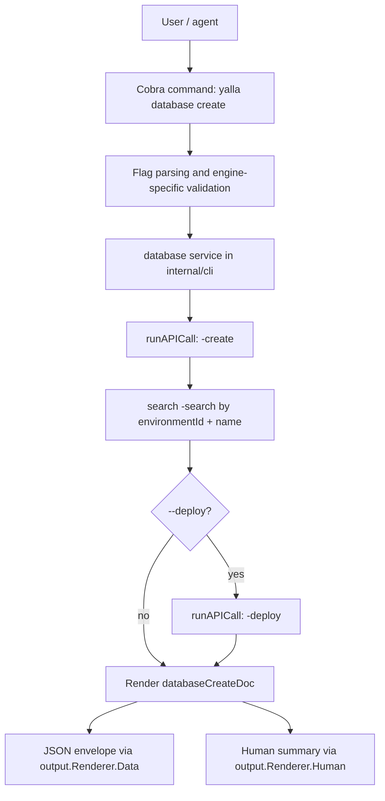
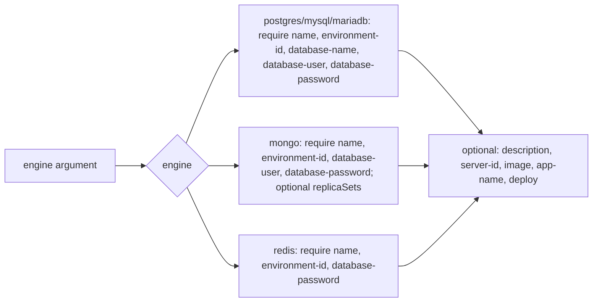
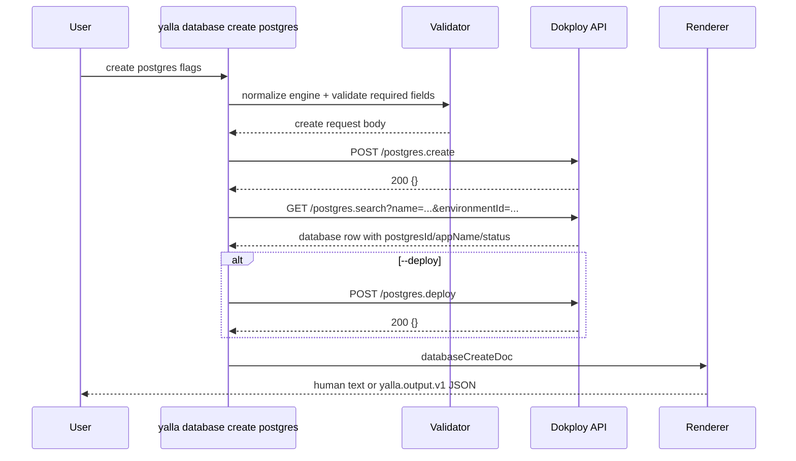

# Friendly Database Commands Implementation Plan

> **For agentic workers:** REQUIRED SUB-SKILL: Use superpowers:subagent-driven-development (recommended) or superpowers:executing-plans to implement this plan task-by-task. Steps use checkbox (`- [ ]`) syntax for tracking.

**Goal:** Add production-grade friendly database commands so users can create and deploy Dokploy-managed Postgres, MySQL, MariaDB, MongoDB, and Redis resources without hand-writing `yalla api call <engine>-create` payloads.

**Architecture:** Add a `database` Cobra command group under `internal/cli`, backed by a small typed database service that translates friendly flags into existing Dokploy OpenAPI operations. Use the embedded OpenAPI schema as the source of truth because the live `https://ploy.jsa.sa/swagger` page redirects to login and API-key-authenticated spec routes return 404; verify behavior against live non-mutating search endpoints. Keep raw API access unchanged, register curated descriptors in `internal/curated`, and make every command emit stable human and JSON output through `internal/output.Renderer`.

**Tech Stack:** Go, Cobra, existing `internal/api` OpenAPI registry/client, existing `internal/output` envelopes, existing `internal/errors` typed errors.

---

## Command Surface

Primary target:

```sh
yalla database create postgres \
  --environment-id env_123 \
  --name eduai-postgres \
  --database-name eduai \
  --database-user eduai \
  --database-password "$POSTGRES_PASSWORD" \
  --image postgres:18
```

Agent mode:

```sh
yalla --json database create postgres \
  --environment-id env_123 \
  --name eduai-postgres \
  --database-name eduai \
  --database-user eduai \
  --database-password "$POSTGRES_PASSWORD"
```

Redis:

```sh
yalla database create redis \
  --environment-id env_123 \
  --name eduai-redis \
  --database-password "$REDIS_PASSWORD" \
  --image redis:8
```

MongoDB with replica sets:

```sh
yalla database create mongo \
  --environment-id env_123 \
  --name eduai-mongo \
  --database-user eduai \
  --database-password "$MONGO_PASSWORD" \
  --replica-sets
```

Deploy after create:

```sh
yalla database deploy postgres --id postgres_123
yalla database deploy redis --id redis_123
```

Optional convenience:

```sh
yalla database create postgres ... --deploy
```

## Architecture Diagram



## Swagger / Live API Findings

Checked on `2026-05-12` against `https://ploy.jsa.sa`:

```text
/swagger            -> redirects to / login page
/api/openapi        -> 404 with valid API key
/api/openapi.json   -> 404 with valid API key
/api/swagger        -> 404 with valid API key
/api/swagger.json   -> 404 with valid API key
/api/docs           -> 404 with valid API key
/api/reference      -> 404 with valid API key
```

Non-mutating database endpoint checks with the configured API key:

```text
/api/postgres.search -> 200 { "items": [], "total": 0 }
/api/mysql.search    -> 200 { "items": [], "total": 0 }
/api/mariadb.search  -> 200 { "items": [], "total": 0 }
/api/mongo.search    -> 200 { "items": [], "total": 0 }
/api/redis.search    -> 200 { "items": [], "total": 0 }
/api/libsql.search   -> 404
/api/libsql.create   -> 404
```

Implications:

- Do not build dynamic Swagger fetching into this feature.
- Use `internal/api/data/openapi.json` and `yalla schema get <operationId>` for schema-driven implementation.
- Add live smoke verification only for non-mutating `*-search` endpoints.
- Keep `libsql` unsupported until a future embedded schema and live instance expose `libsql-*` operations.

## UX And Validation Rules



Rules:

- Supported engines: `postgres`, `mysql`, `mariadb`, `mongo`, `redis`.
- Unsupported `libsql` should fail with `E_UNSUPPORTED` because this embedded OpenAPI spec has no `libsql-*` operations.
- Password flags are accepted for automation, but help must recommend env vars or stdin shell expansion so users do not leak secrets into shell history.
- `--database-name` and `--database-user` are invalid for Redis.
- `--database-name` is invalid for MongoDB.
- `--root-password` applies only to MySQL/MariaDB if the API accepts it; it is optional because `mysql-create` does not require it.
- `--replica-sets` applies only to MongoDB and maps to the optional `replicaSets` request field.
- `--deploy` runs create, recovers the ID via search, then deploys.
- Without `--deploy`, create still recovers and prints the resource ID when possible.

## Files

- Modify: `internal/cli/root.go` to register `newDatabaseCommand()`.
- Create: `internal/cli/database_cmd.go` for Cobra command definitions and output DTOs.
- Create: `internal/cli/database_service.go` for engine metadata, validation, create/deploy/search orchestration.
- Create: `internal/cli/database_cmd_test.go` for CLI behavior, validation, JSON output, help, and command registration tests.
- Modify: `internal/cli/manifest_cmd_test.go` to include top-level `database`.
- Modify: `internal/curated/registry.go` to register curated descriptors for `yalla database create` and `yalla database deploy`.
- Modify: `internal/curated/registry_test.go` to assert database curated mappings.
- Modify: `docs/curated-commands.md` to replace aspirational database examples with concrete supported syntax.
- Modify: `skills/claude/yalla-dokploy-deploy/references/databases.md` to prefer friendly commands and keep raw API calls as fallback.

## Data Flow



## Task 1: Register Database Command Group

**Files:**
- Modify: `internal/cli/root.go`
- Create: `internal/cli/database_cmd.go`
- Test: `internal/cli/database_cmd_test.go`

- [ ] **Step 1: Write failing registration test**

Add a test that expects the top-level command tree to include `database`:

```go
func TestDatabaseCommand_IsRegistered(t *testing.T) {
	cmd := NewRootCommand(IOStreams{}, BuildInfo{Version: "test"})
	found := false
	for _, child := range cmd.Commands() {
		if child.Name() == "database" {
			found = true
			break
		}
	}
	if !found {
		t.Fatal("root command missing database command")
	}
}
```

- [ ] **Step 2: Run the failing test**

```sh
go test ./internal/cli -run TestDatabaseCommand_IsRegistered -count=1
```

Expected: fail because `newDatabaseCommand` is not registered.

- [ ] **Step 3: Add command shell**

Create `internal/cli/database_cmd.go`:

```go
package cli

import "github.com/spf13/cobra"

func newDatabaseCommand() *cobra.Command {
	cmd := &cobra.Command{
		Use:   "database",
		Short: "Manage Dokploy databases",
		Long:  "Manage Dokploy databases with friendly commands backed by the Dokploy API.",
		RunE: func(c *cobra.Command, _ []string) error {
			return c.Help()
		},
	}
	cmd.AddCommand(newDatabaseCreateCommand())
	cmd.AddCommand(newDatabaseDeployCommand())
	return cmd
}

func newDatabaseCreateCommand() *cobra.Command {
	return &cobra.Command{
		Use:   "create <engine>",
		Short: "Create a Dokploy database",
		Args:  cobra.ExactArgs(1),
		RunE: func(c *cobra.Command, args []string) error {
			return nil
		},
	}
}

func newDatabaseDeployCommand() *cobra.Command {
	return &cobra.Command{
		Use:   "deploy <engine>",
		Short: "Deploy a Dokploy database",
		Args:  cobra.ExactArgs(1),
		RunE: func(c *cobra.Command, args []string) error {
			return nil
		},
	}
}
```

Modify `internal/cli/root.go`:

```go
cmd.AddCommand(newDatabaseCommand())
```

- [ ] **Step 4: Run registration test**

```sh
go test ./internal/cli -run TestDatabaseCommand_IsRegistered -count=1
```

Expected: pass.

- [ ] **Step 5: Commit**

```sh
git add internal/cli/root.go internal/cli/database_cmd.go internal/cli/database_cmd_test.go
git commit -m "feat: register database command group"
```

## Task 2: Engine Metadata And Validation

**Files:**
- Create: `internal/cli/database_service.go`
- Modify: `internal/cli/database_cmd.go`
- Test: `internal/cli/database_cmd_test.go`

- [ ] **Step 1: Add validation tests**

Test each engine’s required fields and unsupported engines:

```go
func TestDatabaseCreate_ValidatesRequiredFields(t *testing.T) {
	cases := []struct {
		name string
		args []string
		want string
	}{
		{"postgres missing password", []string{"database", "create", "postgres", "--environment-id", "env_1", "--name", "db", "--database-name", "app", "--database-user", "app"}, "database password is required"},
		{"redis rejects database name", []string{"database", "create", "redis", "--environment-id", "env_1", "--name", "cache", "--database-name", "app", "--database-password", "secret"}, "--database-name is not valid for redis"},
		{"mongo rejects database name", []string{"database", "create", "mongo", "--environment-id", "env_1", "--name", "mongo", "--database-name", "app", "--database-user", "app", "--database-password", "secret"}, "--database-name is not valid for mongo"},
		{"redis rejects replica sets", []string{"database", "create", "redis", "--environment-id", "env_1", "--name", "cache", "--database-password", "secret", "--replica-sets"}, "--replica-sets is not valid for redis"},
		{"libsql unsupported", []string{"database", "create", "libsql", "--environment-id", "env_1", "--name", "db"}, "unsupported database engine"},
	}
	for _, tc := range cases {
		t.Run(tc.name, func(t *testing.T) {
			_, stderr, err := runRootArgs(t, tc.args...)
			if err == nil {
				t.Fatal("expected error")
			}
			if !strings.Contains(stderr, tc.want) {
				t.Fatalf("stderr = %q, want %q", stderr, tc.want)
			}
		})
	}
}
```

- [ ] **Step 2: Implement engine metadata**

Create `internal/cli/database_service.go`:

```go
package cli

import (
	"strings"

	yerr "github.com/JuribaDev/yalla/internal/errors"
)

type databaseEngine string

const (
	databasePostgres databaseEngine = "postgres"
	databaseMySQL    databaseEngine = "mysql"
	databaseMariaDB  databaseEngine = "mariadb"
	databaseMongo    databaseEngine = "mongo"
	databaseRedis    databaseEngine = "redis"
)

type databaseCreateOptions struct {
	Engine           databaseEngine
	Name             string
	AppName          string
	EnvironmentID    string
	DatabaseName     string
	DatabaseUser     string
	DatabasePassword string
	RootPassword     string
	Description      string
	ServerID         string
	Image            string
	ReplicaSets      bool
	Deploy           bool
}

func parseDatabaseEngine(raw string) (databaseEngine, error) {
	switch databaseEngine(strings.ToLower(strings.TrimSpace(raw))) {
	case databasePostgres:
		return databasePostgres, nil
	case databaseMySQL:
		return databaseMySQL, nil
	case databaseMariaDB:
		return databaseMariaDB, nil
	case databaseMongo:
		return databaseMongo, nil
	case databaseRedis:
		return databaseRedis, nil
	case "libsql":
		return "", yerr.New(yerr.CodeUnsupported, "unsupported database engine \"libsql\"").
			WithHint("this yalla build has no libsql OpenAPI operations; use postgres, mysql, mariadb, mongo, or redis")
	default:
		return "", yerr.Newf(yerr.CodeInvalidInput, "unsupported database engine %q", raw).
			WithHint("supported engines: postgres, mysql, mariadb, mongo, redis")
	}
}

func validateDatabaseCreate(o databaseCreateOptions) error {
	if strings.TrimSpace(o.Name) == "" {
		return yerr.New(yerr.CodeInvalidInput, "database name is required").WithHint("pass --name")
	}
	if strings.TrimSpace(o.EnvironmentID) == "" {
		return yerr.New(yerr.CodeInvalidInput, "environment ID is required").WithHint("pass --environment-id")
	}
	if strings.TrimSpace(o.DatabasePassword) == "" && o.Engine != "" {
		return yerr.New(yerr.CodeInvalidInput, "database password is required").WithHint("pass --database-password")
	}
	switch o.Engine {
	case databasePostgres, databaseMySQL, databaseMariaDB:
		if o.ReplicaSets {
			return yerr.New(yerr.CodeInvalidInput, "--replica-sets is not valid for "+string(o.Engine))
		}
		if strings.TrimSpace(o.DatabaseName) == "" {
			return yerr.New(yerr.CodeInvalidInput, "database name inside the server is required").WithHint("pass --database-name")
		}
		if strings.TrimSpace(o.DatabaseUser) == "" {
			return yerr.New(yerr.CodeInvalidInput, "database user is required").WithHint("pass --database-user")
		}
	case databaseMongo:
		if strings.TrimSpace(o.DatabaseName) != "" {
			return yerr.New(yerr.CodeInvalidInput, "--database-name is not valid for mongo")
		}
		if strings.TrimSpace(o.DatabaseUser) == "" {
			return yerr.New(yerr.CodeInvalidInput, "database user is required").WithHint("pass --database-user")
		}
	case databaseRedis:
		if strings.TrimSpace(o.DatabaseName) != "" {
			return yerr.New(yerr.CodeInvalidInput, "--database-name is not valid for redis")
		}
		if strings.TrimSpace(o.DatabaseUser) != "" {
			return yerr.New(yerr.CodeInvalidInput, "--database-user is not valid for redis")
		}
		if o.ReplicaSets {
			return yerr.New(yerr.CodeInvalidInput, "--replica-sets is not valid for redis")
		}
	}
	return nil
}
```

- [ ] **Step 3: Wire flags into create command**

Add flags on `newDatabaseCreateCommand`:

```go
var opts databaseCreateOptions
cmd.Flags().StringVar(&opts.EnvironmentID, "environment-id", "", "Dokploy environment ID")
cmd.Flags().StringVar(&opts.Name, "name", "", "database resource name")
cmd.Flags().StringVar(&opts.AppName, "app-name", "", "optional Dokploy appName override")
cmd.Flags().StringVar(&opts.DatabaseName, "database-name", "", "database name inside the server")
cmd.Flags().StringVar(&opts.DatabaseUser, "database-user", "", "database user")
cmd.Flags().StringVar(&opts.DatabasePassword, "database-password", "", "database password")
cmd.Flags().StringVar(&opts.RootPassword, "root-password", "", "MySQL/MariaDB root password")
cmd.Flags().StringVar(&opts.Description, "description", "", "database description")
cmd.Flags().StringVar(&opts.ServerID, "server-id", "", "target Dokploy server ID")
cmd.Flags().StringVar(&opts.Image, "image", "", "Docker image override")
cmd.Flags().BoolVar(&opts.ReplicaSets, "replica-sets", false, "enable MongoDB replica sets")
cmd.Flags().BoolVar(&opts.Deploy, "deploy", false, "deploy the database immediately after creating it")
```

In `RunE`, call `parseDatabaseEngine`, assign `opts.Engine`, then call `validateDatabaseCreate`.

- [ ] **Step 4: Run validation tests**

```sh
go test ./internal/cli -run TestDatabaseCreate_ValidatesRequiredFields -count=1
```

Expected: pass.

- [ ] **Step 5: Commit**

```sh
git add internal/cli/database_cmd.go internal/cli/database_service.go internal/cli/database_cmd_test.go
git commit -m "feat: validate database create inputs"
```

## Task 3: Create API Orchestration

**Files:**
- Modify: `internal/cli/database_service.go`
- Modify: `internal/cli/database_cmd.go`
- Test: `internal/cli/database_cmd_test.go`

- [ ] **Step 1: Add dry-run or stubbed transport tests**

Use the existing `apiCallClientFactory` seam to assert the friendly command sends `/postgres.create` with the expected JSON body. The test should fail before orchestration exists.

- [ ] **Step 2: Build engine-specific operation mapping**

Add:

```go
func (e databaseEngine) createOperationID() string {
	return string(e) + "-create"
}

func (e databaseEngine) deployOperationID() string {
	return string(e) + "-deploy"
}

func (e databaseEngine) searchOperationID() string {
	return string(e) + "-search"
}

func (e databaseEngine) idField() string {
	switch e {
	case databasePostgres:
		return "postgresId"
	case databaseMySQL:
		return "mysqlId"
	case databaseMariaDB:
		return "mariadbId"
	case databaseMongo:
		return "mongoId"
	case databaseRedis:
		return "redisId"
	default:
		return ""
	}
}
```

- [ ] **Step 3: Add request body builder**

```go
func databaseCreateBody(o databaseCreateOptions) map[string]any {
	body := map[string]any{
		"name":          o.Name,
		"environmentId": o.EnvironmentID,
	}
	if o.AppName != "" {
		body["appName"] = o.AppName
	}
	if o.Description != "" {
		body["description"] = o.Description
	}
	if o.ServerID != "" {
		body["serverId"] = o.ServerID
	}
	if o.Image != "" {
		body["dockerImage"] = o.Image
	}
	switch o.Engine {
	case databasePostgres, databaseMySQL, databaseMariaDB:
		body["databaseName"] = o.DatabaseName
		body["databaseUser"] = o.DatabaseUser
		body["databasePassword"] = o.DatabasePassword
		if o.RootPassword != "" && (o.Engine == databaseMySQL || o.Engine == databaseMariaDB) {
			body["databaseRootPassword"] = o.RootPassword
		}
	case databaseMongo:
		body["databaseUser"] = o.DatabaseUser
		body["databasePassword"] = o.DatabasePassword
		if o.ReplicaSets {
			body["replicaSets"] = true
		}
	case databaseRedis:
		body["databasePassword"] = o.DatabasePassword
	}
	return body
}
```

- [ ] **Step 4: Add service method**

The service should call `runAPICall` instead of duplicating HTTP logic. Build `apiCallInput{Body: rawJSON(body)}` and pass `api.Default()` plus resolved config.

- [ ] **Step 5: Emit stable output DTO**

```go
type databaseCreateDoc struct {
	Engine        string `json:"engine"`
	Name          string `json:"name"`
	EnvironmentID string `json:"environment_id"`
	ID            string `json:"id,omitempty"`
	AppName       string `json:"app_name,omitempty"`
	Deployed      bool   `json:"deployed"`
}
```

Human output:

```text
Created postgres database eduai-postgres
ID: postgres_123
Deploy: skipped
```

- [ ] **Step 6: Run tests**

```sh
go test ./internal/cli -run 'TestDatabaseCreate_' -count=1
```

Expected: pass.

- [ ] **Step 7: Commit**

```sh
git add internal/cli/database_cmd.go internal/cli/database_service.go internal/cli/database_cmd_test.go
git commit -m "feat: create databases through friendly command"
```

## Task 4: ID Recovery After Create

**Files:**
- Modify: `internal/cli/database_service.go`
- Test: `internal/cli/database_cmd_test.go`

- [ ] **Step 1: Add test for empty create response**

Simulate `*-create` returning `{}`, then simulate `*-search` returning a list containing the database with the correct engine-specific ID.

- [ ] **Step 2: Implement search query**

Use:

```json
{
  "query": {
    "name": ["eduai-postgres"],
    "environmentId": ["env_123"],
    "limit": ["20"],
    "offset": ["0"]
  }
}
```

- [ ] **Step 3: Parse common search response defensively**

Dokploy response shapes can drift. Parse into `map[string]any`, support both direct arrays and `{ "items": [...] }` / `{ "databases": [...] }` style containers, and match by exact `name` plus `environmentId` where present.

- [ ] **Step 4: If ID recovery fails, return success with hint**

Creation succeeded, so do not turn this into a failed create. Emit:

```text
Created postgres database eduai-postgres
ID: not recovered; run `yalla database list --type postgres --environment-id env_123`
```

- [ ] **Step 5: Run tests**

```sh
go test ./internal/cli -run 'TestDatabaseCreate_RecoversID|TestDatabaseCreate_IDRecoveryFailureStillReportsCreate' -count=1
```

- [ ] **Step 6: Commit**

```sh
git add internal/cli/database_service.go internal/cli/database_cmd_test.go
git commit -m "feat: recover database id after create"
```

## Task 5: Deploy Command And `--deploy`

**Files:**
- Modify: `internal/cli/database_cmd.go`
- Modify: `internal/cli/database_service.go`
- Test: `internal/cli/database_cmd_test.go`

- [ ] **Step 1: Add tests for standalone deploy**

Assert:

```sh
yalla database deploy postgres --id postgres_123
```

sends:

```json
{ "body": { "postgresId": "postgres_123" } }
```

to `postgres-deploy`.

- [ ] **Step 2: Add tests for create with `--deploy`**

Assert call order:

1. `postgres-create`
2. `postgres-search`
3. `postgres-deploy`

- [ ] **Step 3: Implement deploy options**

```go
type databaseDeployOptions struct {
	Engine databaseEngine
	ID     string
}
```

Validate `--id` and engine, then call `runAPICall` with the engine-specific ID field.

- [ ] **Step 4: Run tests**

```sh
go test ./internal/cli -run 'TestDatabaseDeploy_|TestDatabaseCreate_WithDeploy' -count=1
```

- [ ] **Step 5: Commit**

```sh
git add internal/cli/database_cmd.go internal/cli/database_service.go internal/cli/database_cmd_test.go
git commit -m "feat: deploy databases through friendly command"
```

## Task 6: Manifest And Curated Registry

**Files:**
- Modify: `internal/curated/registry.go`
- Modify: `internal/curated/registry_test.go`
- Modify: `internal/cli/manifest_cmd_test.go`

- [ ] **Step 1: Add curated registry tests**

Assert `curated.Default()` includes:

```go
Path: "yalla database create"
Domain: curated.DomainDatabase
Verb: "create"
OperationIDs: []string{
	"postgres-create", "mysql-create", "mariadb-create", "mongo-create", "redis-create",
	"postgres-search", "mysql-search", "mariadb-search", "mongo-search", "redis-search",
}
```

and:

```go
Path: "yalla database deploy"
OperationIDs: []string{
	"postgres-deploy", "mysql-deploy", "mariadb-deploy", "mongo-deploy", "redis-deploy",
}
```

- [ ] **Step 2: Register curated descriptors**

Append to `defaultCommands` in `internal/curated/registry.go`, keeping entries grouped and sorted by path.

- [ ] **Step 3: Update manifest top-level command expectation**

Change `wantTopLevel` in `internal/cli/manifest_cmd_test.go` to include `database`.

- [ ] **Step 4: Run manifest and curated tests**

```sh
go test ./internal/curated ./internal/cli -run 'TestDefault|TestManifest' -count=1
```

- [ ] **Step 5: Commit**

```sh
git add internal/curated/registry.go internal/curated/registry_test.go internal/cli/manifest_cmd_test.go
git commit -m "feat: publish database commands in manifest"
```

## Task 7: Documentation And Deploy Skill Update

**Files:**
- Modify: `docs/curated-commands.md`
- Modify: `skills/claude/yalla-dokploy-deploy/references/databases.md`

- [ ] **Step 1: Update curated command docs**

Document:

```sh
yalla database create postgres --environment-id env_123 --name app-postgres --database-name app --database-user app --database-password "$DATABASE_PASSWORD"
yalla database create redis --environment-id env_123 --name app-redis --database-password "$REDIS_PASSWORD"
yalla database create mongo --environment-id env_123 --name app-mongo --database-user app --database-password "$MONGO_PASSWORD" --replica-sets
yalla database deploy postgres --id postgres_123
```

- [ ] **Step 2: Update deploy skill reference**

Change the database flow from raw API first to friendly command first:

```text
Preferred:
  yalla database create <engine> ... --deploy

Fallback:
  yalla --json api call <engine>-create --input ...
  yalla --json api call <engine>-deploy --input ...
```

- [ ] **Step 3: Run docs-related tests**

```sh
go test ./internal/cli -run 'TestDocs|TestManifest' -count=1
```

- [ ] **Step 4: Commit**

```sh
git add docs/curated-commands.md skills/claude/yalla-dokploy-deploy/references/databases.md
git commit -m "docs: document friendly database commands"
```

## Task 8: Security And Redaction Regression

**Files:**
- Modify: `internal/cli/redaction_security_test.go`
- Modify: `internal/cli/database_cmd_test.go`

- [ ] **Step 1: Add password leak tests**

Run create in human, JSON, and verbose modes using sentinel password `super-secret-db-password`. Assert it does not appear in stdout or stderr.

- [ ] **Step 2: Redact database password in output**

Do not include `database_password` in `databaseCreateDoc`. Add the password to the renderer redactor for database command execution if necessary.

- [ ] **Step 3: Verify dry-run/help examples do not encourage literal secrets**

Examples should use shell variables:

```sh
--database-password "$DATABASE_PASSWORD"
```

not:

```sh
--database-password supersecret
```

- [ ] **Step 4: Run security tests**

```sh
go test ./internal/cli -run 'Redaction|Database.*Password' -count=1
```

- [ ] **Step 5: Commit**

```sh
git add internal/cli/redaction_security_test.go internal/cli/database_cmd_test.go internal/cli/database_cmd.go
git commit -m "test: prevent database password leaks"
```

## Task 9: Live Non-Mutating Smoke Verification

**Files:**
- Modify: `docs/curated-commands.md`

- [ ] **Step 1: Add a manual live verification note**

Document that live verification must use non-mutating search endpoints because `/swagger` and common OpenAPI JSON routes are not exposed on `https://ploy.jsa.sa`.

- [ ] **Step 2: Run live smoke checks**

Run this only when `yalla auth status` reports `ready: true` for the target Dokploy instance:

```sh
for op in postgres-search mysql-search mariadb-search mongo-search redis-search; do
  go run ./cmd/yalla --json api call "$op" \
    --input <(printf '{"query":{"limit":["1"],"offset":["0"]}}') \
    --timeout 10s
done
```

Expected: each command returns HTTP `200` and a JSON body with `items` and `total`.

- [ ] **Step 3: Confirm libsql stays unsupported**

Run:

```sh
TOKEN="$(security find-generic-password -s yalla -wa https://ploy.jsa.sa 2>/dev/null | python3 -c 'import sys,base64; s=sys.stdin.read().strip(); print(base64.b64decode(s.split(":",1)[1]).decode() if s.startswith("go-keyring-base64:") else s)')"
curl -sS -o /tmp/libsql-check.out -w 'HTTP:%{http_code}\n' -H "X-Api-Key: $TOKEN" https://ploy.jsa.sa/api/libsql.search
rm -f /tmp/libsql-check.out
```

Expected: HTTP `404`.

- [ ] **Step 4: Commit**

```sh
git add docs/curated-commands.md
git commit -m "docs: add live database endpoint verification"
```

## Final Verification

Run:

```sh
go test ./...
go run ./cmd/yalla --json manifest
go run ./cmd/yalla database create postgres --help
go run ./cmd/yalla database deploy postgres --help
for op in postgres-search mysql-search mariadb-search mongo-search redis-search; do
  go run ./cmd/yalla --json api call "$op" --input <(printf '{"query":{"limit":["1"],"offset":["0"]}}') --timeout 10s
done
```

Expected:

- All tests pass.
- Manifest includes top-level `database`.
- Manifest includes curated commands `yalla database create` and `yalla database deploy`.
- Help shows supported engines and safe password examples.
- `libsql` returns `E_UNSUPPORTED`.
- Redis rejects user/database flags.
- Mongo rejects database-name and accepts `--replica-sets`.
- Live non-mutating search endpoints return HTTP 200 on `https://ploy.jsa.sa`.
- JSON output never contains raw database passwords.

## Rollout Notes

- This is additive. Existing `yalla api call <engine>-create` workflows remain supported.
- The first release should document `database create` and `database deploy` only. `database list/get/start/stop/logs` can follow as separate, smaller stories using the same engine metadata.
- If Dokploy later adds `libsql-*` operations, add `libsql` as a new engine with its own validation and output tests instead of overloading Redis/Postgres behavior.
