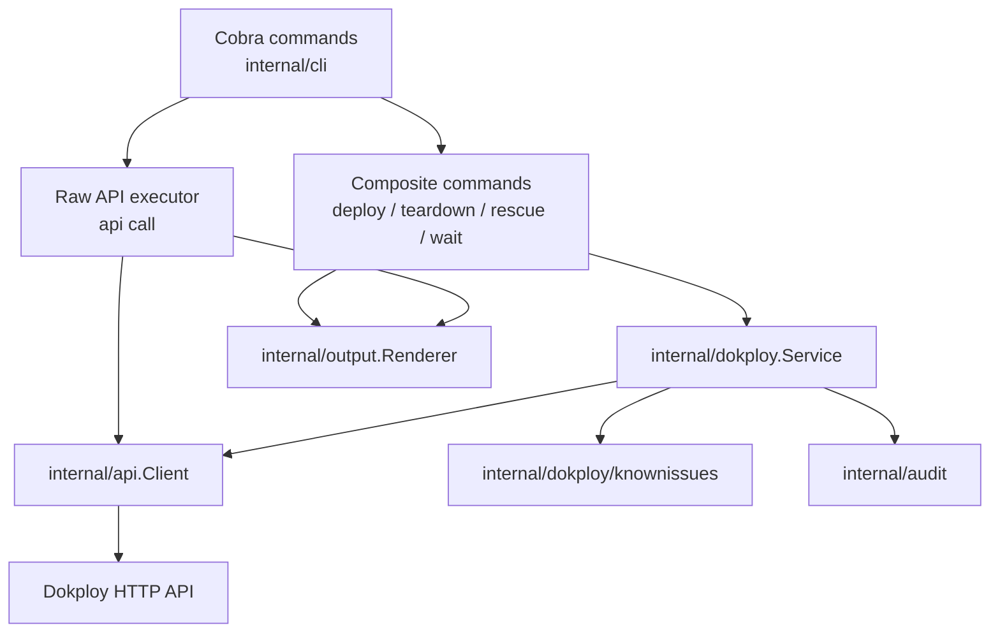
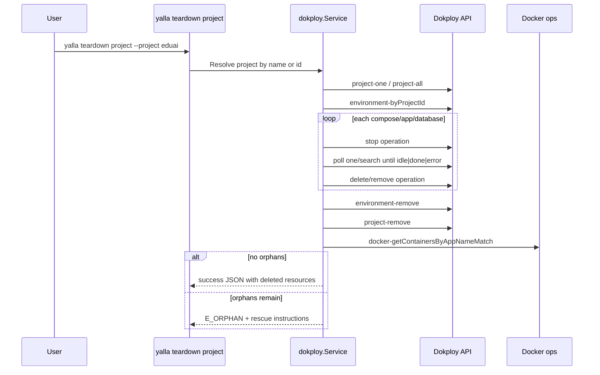
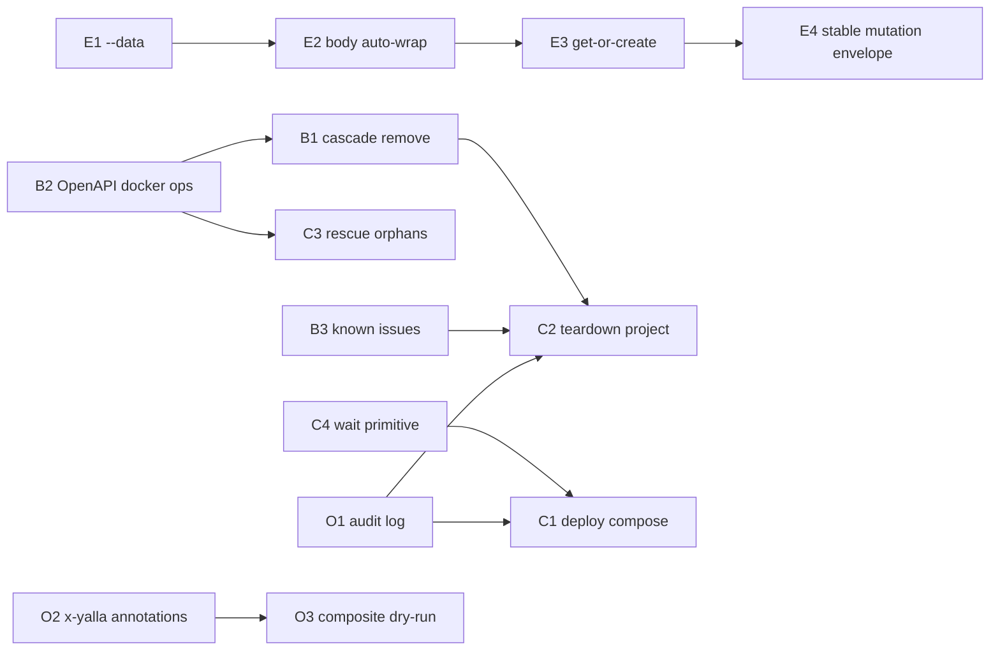

# Yalla AI-First Upstream Fixes Implementation Plan

> Historical implementation plan snapshot. It is kept for rationale and task
> history, not as the current CLI or API reference. Use `README.md`,
> `docs/development/cli-backend-command-parity.md`, and `yalla --json manifest`
> for the authoritative command surface.

> **For agentic workers:** REQUIRED SUB-SKILL: Use superpowers:subagent-driven-development (recommended) or superpowers:executing-plans to implement this plan task-by-task. Steps use checkbox (`- [ ]`) syntax for tracking.

**Goal:** Make yalla safely orchestrate Dokploy lifecycle operations for AI agents, preventing orphaned resources and reducing raw API boilerplate.

**Architecture:** Keep `yalla api call` as the universal low-level executor, then layer typed orchestration services above it for cascade teardown, deployment, rescue, waiting, idempotency, and audit logging. The `internal/api` package remains the HTTP/spec boundary; `internal/cli` owns command UX; new orchestration code lives in small `internal/dokploy` and `internal/audit` packages so composite commands do not become large Cobra handlers.

**Tech Stack:** Go, Cobra, embedded OpenAPI JSON, `httptest` unit tests, existing `internal/output.Renderer`, existing typed `internal/errors` contract.

---

## System Diagrams

### Target Command Architecture



### Safe Teardown Flow



### Delivery Dependency Graph



## File Structure

- Create `internal/dokploy/service.go`: operation runner abstraction used by composite commands.
- Create `internal/dokploy/lifecycle.go`: cascade teardown and stop/delete orchestration.
- Create `internal/dokploy/deploy_compose.go`: project/env/compose/domain orchestration.
- Create `internal/dokploy/wait.go`: polling primitives for compose, URL, and orphan counts.
- Create `internal/dokploy/knownissues.go`: embedded known-issue matcher and enriched error conversion.
- Create `internal/dokploy/known_issues.yaml`: small data file for upstream bug signatures.
- Create `internal/audit/audit.go`: mutation audit log writer and tail reader.
- Modify `internal/errors/errors.go`: add `E_ORPHAN` and `E_UPSTREAM_BUG` codes with stable exit codes.
- Modify `internal/api/registry.go`, `internal/api/schema.go`: preserve and expose `x-yalla-*` OpenAPI extensions.
- Modify `internal/api/data/openapi.json`, `internal/api/openapi.go`, `internal/api/registry_test.go`, `ralph/prd.json`: spec regeneration and digest pin updates after Dokploy OpenAPI changes.
- Modify `internal/cli/api_call_cmd.go`: add `--data`, body auto-wrap, known-issue wrapping, appName warning envelope, idempotent/get-or-create flags.
- Modify `internal/cli/root.go`: register `deploy`, `teardown`, `rescue`, `wait`, and `audit` command trees.
- Create `internal/cli/deploy_cmd.go`, `internal/cli/teardown_cmd.go`, `internal/cli/rescue_cmd.go`, `internal/cli/wait_cmd.go`, `internal/cli/audit_cmd.go`.
- Modify `internal/curated/registry.go`: add descriptors for composite commands so manifest/docs expose them.
- Modify `docs/curated-commands.md`, `README.md`, `skills/*/yalla-dokploy-deploy/references/*.md`: document new public contracts.

## Phase 0: Safety Foundation

### Task 0.1: Add Stable Error Codes

**Files:**
- Modify `internal/errors/errors.go`
- Test `internal/errors/errors_test.go`
- Test `internal/cli/error_render_test.go`

- [ ] Add `CodeOrphan Code = "E_ORPHAN"` and `CodeUpstreamBug Code = "E_UPSTREAM_BUG"`.
- [ ] Map `E_ORPHAN` to exit code `3` as requested by the spec.
- [ ] Map `E_UPSTREAM_BUG` to exit code `8`, same operational class as upstream server failures.
- [ ] Extend `codeDescriptions` and `AllCodes()` ordering.
- [ ] Add tests asserting code strings, exit codes, manifest parity, and JSON rendering.
- [ ] Run:

```bash
go test ./internal/errors ./internal/cli -run 'Error|Manifest'
```

Expected: tests pass and manifest includes both new codes.

### Task 0.2: Introduce Operation Runner

**Files:**
- Create `internal/dokploy/service.go`
- Create `internal/dokploy/service_test.go`

- [ ] Define a narrow `Runner` interface:

```go
type Runner interface {
    Call(ctx context.Context, operationID string, input apiCallInputLike) (*Result, error)
}
```

- [ ] Keep the concrete implementation backed by `api.Client`, not by shelling out to `yalla api call`.
- [ ] Return typed `dokploy.Result` values containing operation id, status, JSON body, duration, request id, and trace id.
- [ ] Unit test request construction with `httptest.Server`.

## Phase 1: Close Orphan-Resource Failure Mode

### Task 1.1: Upstream OpenAPI Docker Write Ops

**Files:**
- External PR: `Dokploy/dokploy` OpenAPI registration
- Modify local `internal/api/data/openapi.json`
- Modify `internal/api/openapi.go`
- Modify `internal/api/registry_test.go`
- Modify `ralph/prd.json`

- [ ] Open Dokploy PR registering these operations in the OpenAPI schema:
  `docker-stopContainer`, `docker-removeContainer`, `docker-removeNetwork`, `docker-removeVolume`, `docker-compose-down`.
- [ ] Regenerate `internal/api/data/openapi.json`.
- [ ] Update `EmbeddedSpecSHA256`, `expectedOperationCount`, and PRD pin.
- [ ] Add coverage rows in `internal/cli/api_coverage_test.go` for all five operations.
- [ ] Run:

```bash
go test ./internal/api ./internal/cli -run 'Registry|APICoverage|APIOperations'
```

Expected: operation count increases and all new operation IDs are callable through `yalla api call`.

### Task 1.2: Implement Safe Cascade Teardown

**Files:**
- Create `internal/dokploy/lifecycle.go`
- Create `internal/dokploy/lifecycle_test.go`
- Create `internal/cli/teardown_cmd.go`
- Create `internal/cli/teardown_cmd_test.go`
- Modify `internal/cli/root.go`

- [ ] Add `yalla teardown project --project <name-or-id> [--no-cascade] [--timeout 5m]`.
- [ ] Resolve project by id first; if not found, list projects and match exact `name`.
- [ ] Enumerate environments with `environment-byProjectId`.
- [ ] Enumerate compose/application/database resources for each environment using the available `*-all`, `*-search`, or `*-one` operations from the embedded spec.
- [ ] For each compose, call `compose-stop`; if `E_UPSTREAM_BUG`, call `docker-compose-down` by `appName`.
- [ ] Poll compose state through `WaitCompose` until terminal `idle|done|error` or timeout.
- [ ] Delete/remove resources only after stop/down completes.
- [ ] Remove environments, then project.
- [ ] Assert no containers remain using `docker-getContainersByAppNameMatch` for every captured appName.
- [ ] Return `E_ORPHAN` with app names, container ids, and `yalla rescue orphans --app-name <name>` instructions when assertion fails.
- [ ] Keep `--no-cascade` wired to the old raw `project-remove` behavior with a clear warning in human output.
- [ ] Run:

```bash
go test ./internal/dokploy ./internal/cli -run 'Teardown|Lifecycle'
```

Expected: tests verify operation ordering, fallback behavior, timeout, and orphan assertion.

## Phase 2: Raw API Ergonomics

### Task 2.1: Add Inline JSON and Body Auto-Wrap

**Files:**
- Modify `internal/cli/api_call_cmd.go`
- Modify `internal/cli/api_call_cmd_test.go`
- Modify `internal/cli/AGENTS.md`
- Modify `README.md`

- [ ] Add `--data string` to `yalla api call`.
- [ ] Reject simultaneous `--input` and `--data` with `E_INVALID_INPUT`.
- [ ] Decode `--data` exactly like `--input`, using `json.Decoder.UseNumber`.
- [ ] If top-level object has none of `path_params`, `query`, `headers`, `body`, `files`, treat the whole object as `body`.
- [ ] Preserve the current unknown-field failure when any envelope key is present.
- [ ] Add tests:
  `--data '{"name":"x"}'` dry-runs as body,
  `--data '{"body":{"name":"x"}}'` stays explicit,
  `--input` plus `--data` fails,
  `{"bdoy":...}` still fails when another envelope key exists.
- [ ] Run:

```bash
go test ./internal/cli -run 'APICall'
```

Expected: old `--input` tests still pass and single-line `--data` calls work.

### Task 2.2: Stable Mutation Envelope and Get-Or-Create

**Files:**
- Create `internal/dokploy/idempotency.go`
- Create `internal/dokploy/idempotency_test.go`
- Modify `internal/cli/api_call_cmd.go`
- Modify `internal/cli/api_call_cmd_test.go`

- [ ] Add `--get-or-create` to `yalla api call <*-create>`.
- [ ] Add an operation mapping table from create op to list/search op, id field, name field, and parent scope fields.
- [ ] Before create, list/search scoped records and return exact name match when present.
- [ ] After create with `{}` body, re-list/search and return the created record.
- [ ] The success envelope should include `body` with the record and `idempotent_result: "existing"|"created"`.
- [ ] Reject `--get-or-create` on non-create operations with `E_INVALID_INPUT`.
- [ ] Run:

```bash
go test ./internal/dokploy ./internal/cli -run 'GetOrCreate|MutationEnvelope|APICall'
```

Expected: create ops return a record body and repeat create by name returns the existing record.

## Phase 3: Known Issues and Warnings

### Task 3.1: Wrap Upstream Bugs

**Files:**
- Create `internal/dokploy/knownissues.go`
- Create `internal/dokploy/known_issues.yaml`
- Create `internal/dokploy/knownissues_test.go`
- Modify `internal/cli/api_call_cmd.go`

- [ ] Add embedded matcher fields: `id`, `op`, `status`, `body_contains`, `classification`, `upstream_issue`, `workaround`.
- [ ] Add seed record for `compose-stop` + HTTP 500 + `spawn /bin/sh ENOENT`.
- [ ] When `api.Result` is non-success, match before `result.AsError()`.
- [ ] Return `E_UPSTREAM_BUG` with machine-readable details in JSON mode and concise hint in human mode.
- [ ] Run:

```bash
go test ./internal/dokploy ./internal/cli -run 'KnownIssue|UpstreamBug|APICall_500'
```

Expected: the known 500 becomes `E_UPSTREAM_BUG`; unknown 500 remains `E_SERVER`.

### Task 3.2: Warn on appName Mutation

**Files:**
- Modify `internal/cli/api_call_cmd.go`
- Modify `internal/cli/api_call_cmd_test.go`
- Modify `skills/codex/yalla-dokploy-deploy/references/sources.md`
- Modify `skills/claude/yalla-dokploy-deploy/references/sources.md`

- [ ] Add `--strict-appname` to `compose-create` calls only.
- [ ] Compare requested body `appName` to response body `appName`.
- [ ] On mismatch, attach `warnings: [{code:"APPNAME_MUTATED", requested:"...", actual:"..."}]`.
- [ ] With `--strict-appname`, convert mismatch to `E_INVALID_INPUT`.
- [ ] Document that adopting an existing Docker stack by appName is unsupported; use `compose-import` if upstream supports it, or `rescue orphans` for cleanup.
- [ ] Run:

```bash
go test ./internal/cli -run 'AppName|APICall'
```

Expected: non-strict emits warning; strict fails before an agent assumes adoption worked.

## Phase 4: Composite Verbs

### Task 4.1: Add Wait Primitive

**Files:**
- Create `internal/dokploy/wait.go`
- Create `internal/dokploy/wait_test.go`
- Create `internal/cli/wait_cmd.go`
- Create `internal/cli/wait_cmd_test.go`
- Modify `internal/cli/root.go`

- [ ] Implement `yalla wait compose --id X --status done --timeout 300s`.
- [ ] Implement `yalla wait url --url https://x --status-class 2xx --timeout 120s`.
- [ ] Implement `yalla wait orphans --app-name X --count 0 --timeout 60s`.
- [ ] Use context deadlines and fixed jittered polling intervals.
- [ ] Return structured timeout payload listing the last observed state.
- [ ] Run:

```bash
go test ./internal/dokploy ./internal/cli -run 'Wait'
```

Expected: polling succeeds, times out deterministically, and never busy-loops.

### Task 4.2: Add Deploy Compose

**Files:**
- Create `internal/dokploy/deploy_compose.go`
- Create `internal/dokploy/deploy_compose_test.go`
- Create `internal/cli/deploy_cmd.go`
- Create `internal/cli/deploy_cmd_test.go`
- Modify `internal/cli/root.go`

- [ ] Add `yalla deploy compose`.
- [ ] Accept `--project`, `--env`, `--compose-file`, `--env-file`, repeated `--domain host:service:port`, `--get-or-create`, `--dry-run`, `--timeout`.
- [ ] Preflight required local files, parse compose YAML enough to confirm declared services exist for every `--domain`.
- [ ] Resolve/create project and environment.
- [ ] Resolve/create compose record.
- [ ] Update compose file and env content through the proper `compose-update` shape.
- [ ] Create/update domain bindings.
- [ ] Trigger `compose-deploy`.
- [ ] Poll with `WaitCompose`.
- [ ] Emit JSON with project, environment, compose, domains, deployment status, and ordered operations.
- [ ] Run:

```bash
go test ./internal/dokploy ./internal/cli -run 'DeployCompose'
```

Expected: dry-run prints ordered calls; live-mode test with stub server proves correct ordering and final status.

### Task 4.3: Add Rescue Orphans

**Files:**
- Create `internal/dokploy/rescue.go`
- Create `internal/dokploy/rescue_test.go`
- Create `internal/cli/rescue_cmd.go`
- Create `internal/cli/rescue_cmd_test.go`
- Modify `internal/cli/root.go`

- [ ] Add `yalla rescue orphans --app-name <name> [--ssh root@host]`.
- [ ] Prefer `docker-compose-down` API when present.
- [ ] Verify count with `docker-getContainersByAppNameMatch`.
- [ ] If API op is missing or unsupported and `--ssh` is absent, print the SSH one-liner and return `E_UNSUPPORTED`.
- [ ] If `--ssh` is provided, only execute SSH after explicit flag confirmation such as `--execute-ssh`; otherwise dry-run the command.
- [ ] Run:

```bash
go test ./internal/dokploy ./internal/cli -run 'Rescue'
```

Expected: API path cleans orphans; fallback is explicit and non-surprising.

## Phase 5: Observability and Schema Intelligence

### Task 5.1: Mutation Audit Log

**Files:**
- Create `internal/audit/audit.go`
- Create `internal/audit/audit_test.go`
- Create `internal/cli/audit_cmd.go`
- Create `internal/cli/audit_cmd_test.go`
- Modify `internal/cli/root.go`

- [ ] Append one JSONL record per mutation to `$XDG_DATA_HOME/yalla/audit.log` or `~/.local/share/yalla/audit.log`.
- [ ] Record timestamp, op, target, status, error_code, duration_ms, request_id, trace_id.
- [ ] Redact token-like values before writing.
- [ ] Add `yalla audit tail [--lines 50]`.
- [ ] Run:

```bash
go test ./internal/audit ./internal/cli -run 'Audit'
```

Expected: mutation calls append redacted records; tail renders human and JSON output.

### Task 5.2: x-yalla OpenAPI Annotations

**Files:**
- Modify `internal/api/registry.go`
- Modify `internal/api/schema.go`
- Modify `internal/api/registry_test.go`
- Modify `internal/cli/schema_cmd_test.go`
- Modify `internal/api/data/openapi.json`

- [ ] Add `Extensions map[string]json.RawMessage` to `api.Operation`.
- [ ] Preserve keys with prefix `x-yalla-` from each raw operation.
- [ ] Include extensions in `schema get` JSON and human output.
- [ ] Annotate composite-relevant operations with cascade, idempotency, postcondition, and side-effect hints.
- [ ] Run:

```bash
go test ./internal/api ./internal/cli -run 'Schema|Registry'
```

Expected: agents can inspect yalla-specific planning hints without scraping docs.

### Task 5.3: Composite Dry-Run

**Files:**
- Modify `internal/dokploy/deploy_compose.go`
- Modify `internal/dokploy/lifecycle.go`
- Modify `internal/cli/deploy_cmd.go`
- Modify `internal/cli/teardown_cmd.go`
- Modify corresponding tests

- [ ] Represent composite plans as `[]PlannedOperation{Order, OperationID, Input, Postcondition}`.
- [ ] `--dry-run` must resolve local files and names, but must not mutate Dokploy.
- [ ] Emit the ordered operation list through the standard output envelope.
- [ ] Run:

```bash
go test ./internal/dokploy ./internal/cli -run 'DryRun|DeployCompose|Teardown'
```

Expected: dry-run can be shown to a human before execution and is byte-stable enough for golden tests.

## Final Verification

- [ ] Run full unit suite:

```bash
go test ./...
```

- [ ] Run shell verification:

```bash
./scripts/verify.sh
```

- [ ] Run manual dry-run smoke checks:

```bash
go run ./cmd/yalla --json api call project-create --data '{"name":"smoke"}' --dry-run
go run ./cmd/yalla --json wait url --url https://example.com --status-class 2xx --timeout 10s
go run ./cmd/yalla --json deploy compose --project smoke --env staging --compose-file docker-compose.yml --dry-run
```

- [ ] Against a disposable Dokploy instance, run:

```bash
yalla --json deploy compose --project yalla-smoke --env staging --compose-file docker-compose.deploy.yml --get-or-create
yalla --json teardown project --project yalla-smoke
yalla --json wait orphans --app-name yalla-smoke --count 0 --timeout 60s
```

Expected: no orphan containers, volumes, or networks remain; failures return typed errors with rescue paths.

## Release Strategy

1. Ship Phase 1 and Phase 2 behind normal flags first; they change the highest-risk behavior and raw ergonomics.
2. Cut a minor release because `project-remove` default behavior changes safely but visibly.
3. Ship composite commands after the Docker write ops are in the embedded spec.
4. Keep a compatibility note: raw `yalla api call project-remove --no-cascade` remains available for users that explicitly want the old behavior.

## Issue Split

- PR 1: `--data`, body auto-wrap, new error codes.
- PR 2: Dokploy OpenAPI docker write ops and yalla spec regeneration.
- PR 3: known issues wrapper and appName warning.
- PR 4: lifecycle service plus `teardown project`.
- PR 5: `wait` primitive.
- PR 6: `deploy compose`.
- PR 7: `rescue orphans`.
- PR 8: audit log, annotations, composite dry-run docs.
