# CLI Backend-Only Migration Implementation Plan

> Historical implementation plan snapshot. It is kept for rationale and task
> history, not as the current CLI or API reference. Use `README.md`,
> `docs/development/cli-backend-command-parity.md`, and `yalla --json manifest`
> for the authoritative command surface.

> **For agentic workers:** REQUIRED SUB-SKILL: Use superpowers:subagent-driven-development (recommended) or superpowers:executing-plans to implement this plan task-by-task. Steps use checkbox (`- [ ]`) syntax for tracking.

**Goal:** Make `yalla` CLI a first-class Yalla Control Plane client, equivalent to the frontend app, with all normal user operations going through the backend and only the backend/worker using Dokploy.

**Architecture:** The CLI must authenticate to the Yalla backend with `Authorization: Bearer <yalla-token>` and must not send customer-supplied Dokploy credentials. The backend owns tenancy, policy, quota, audit, desired state, durable jobs, and worker orchestration; the worker is the only normal component that talks to Dokploy with private infrastructure credentials.

**Tech Stack:** Go, Cobra CLI, existing `internal/config`, existing `internal/api` transport where appropriate, Yalla Control Plane HTTP API in `internal/controlplane/httpapi`, Postgres-backed control-plane services, worker jobs in `internal/controlplane/worker`.

---

## Target Architecture

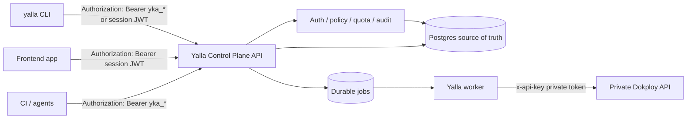

## Current State To Remove

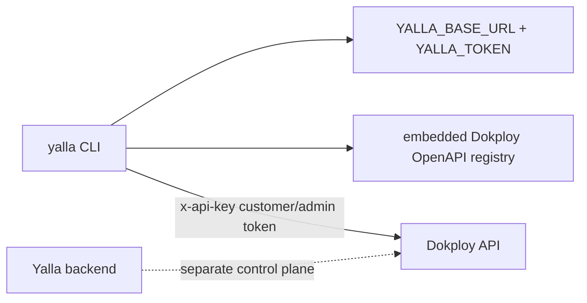

## Required End State

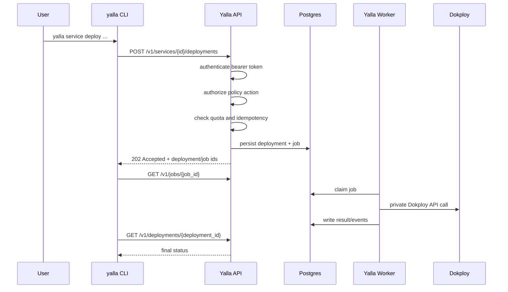

## Non-Negotiable Rules

- The CLI must never require a Dokploy URL or Dokploy token for normal user commands.
- The CLI token must be a Yalla backend credential: API key `yka_*` or supported backend session/JWT token.
- The CLI must send auth as `Authorization: Bearer <token>`.
- The backend and worker may use `YALLA_DOKPLOY_BASE_URL` and `YALLA_DOKPLOY_TOKEN`; the CLI may not.
- Raw Dokploy operation execution must be removed from normal CLI usage or moved behind an explicitly admin-only diagnostic command that talks to the backend, not directly to Dokploy.
- Every mutating CLI command must be represented as a backend product route, not a raw Dokploy route.
- The backend must persist desired state before enqueueing Dokploy work.
- Every mutating backend route must enforce auth, policy, idempotency where relevant, audit logging, and quota/reservation where relevant.
- JSON output and stdout/stderr separation must stay compatible with the current CLI contract.

## File Responsibility Map

### CLI

- `internal/config/config.go`: Rename the public meaning of base URL/token from Dokploy to Yalla API while preserving compatibility aliases during migration.
- `internal/config/load.go`: Keep precedence as CLI flag > env > credential store > config file; change validation/help semantics to Yalla API URL and Yalla token.
- `internal/config/file.go`: Persist `base_url` as Yalla API URL; keep migration-safe reading of old configs.
- `internal/cli/root.go`: Update global flag help, config mirroring, and redaction to Yalla backend terminology.
- `internal/cli/auth_cmd.go`: Replace Dokploy `user-get` verification with Yalla `/v1/me`; store Yalla backend credentials only.
- `internal/cli/api_call_cmd.go`: Remove or repurpose direct Dokploy raw execution.
- `internal/cli/api_cmd.go`: Replace Dokploy operation inspection with Yalla backend OpenAPI inspection, or clearly mark old Dokploy schema inspection as unsupported/deprecated.
- `internal/cli/schema_cmd.go`: Use Yalla backend OpenAPI schemas, not embedded Dokploy schemas.
- `internal/cli/dokploy_service.go`: Delete or quarantine; no normal CLI command should construct a Dokploy client.
- `internal/cli/database_service.go`: Rewrite operations to backend service/database endpoints.
- `internal/cli/deploy_cmd.go`: Rewrite deployment commands to backend deployment endpoints.
- `internal/cli/wait_cmd.go`: Wait on backend jobs/deployments, not Dokploy status endpoints.
- `internal/cli/teardown_cmd.go`: Rewrite destructive flows to backend delete/restore endpoints and backend jobs.
- `internal/cli/rescue_cmd.go`: Decide whether this becomes admin backend diagnostics or is removed from normal CLI.
- `internal/cli/*_test.go`: Update command tests to assert backend URLs, `Authorization` headers, backend envelopes, and no Dokploy headers.

### Shared API Client

- `internal/api/client.go`: Either keep as generic HTTP transport and update comments away from Dokploy-only language, or split into `internal/yallaapi/client.go` for backend calls and leave `internal/api` only for legacy Dokploy registry during the transition.
- `internal/api/data/openapi.json`: Stop using the embedded Dokploy spec as the primary CLI contract.
- `internal/api/openapi.go`, `internal/api/registry.go`: Either point to generated/snapshotted Yalla backend OpenAPI or move to a legacy package.

### Backend HTTP API

- `internal/controlplane/httpapi/routes.go`: Add any missing product routes required by CLI parity.
- `internal/controlplane/httpapi/me.go`: Ensure `/v1/me` is the CLI login verification endpoint.
- `internal/controlplane/httpapi/projects.go`: Ensure create/list/get/update/delete/restore support CLI workflows.
- `internal/controlplane/httpapi/project_environments.go`, `internal/controlplane/httpapi/environments.go`: Ensure environment workflows support CLI workflows.
- `internal/controlplane/httpapi/environment_services.go`, `internal/controlplane/httpapi/services.go`: Ensure service create/update/delete/rendered/runtime controls support CLI workflows.
- `internal/controlplane/httpapi/service_deployments*.go`, `internal/controlplane/httpapi/deployments.go`: Ensure deploy/list/get/cancel/rollback support CLI workflows.
- `internal/controlplane/httpapi/service_domains*.go`: Ensure domain create/update/delete triggers backend reconciliation to Dokploy.
- `internal/controlplane/httpapi/service_backups*.go`: Add/verify backup run and restore route coverage.
- `internal/controlplane/httpapi/jobs.go`: Ensure job list/get/cancel/retry responses are enough for CLI wait/progress UX.
- `internal/controlplane/httpapi/openapi` route in `routes.go`: Ensure OpenAPI exposes the complete Yalla backend contract used by CLI.

### Backend Store And Worker

- `internal/controlplane/jobs/types.go`: Ensure every backend-side effect has a durable job type.
- `internal/controlplane/jobs/enqueuer.go`: Add first-class enqueue methods for every CLI-exposed side effect.
- `internal/controlplane/store/serviceservice.go`: Ensure service mutations enqueue worker jobs consistently.
- `internal/controlplane/store/service_domain.go`: Ensure domain mutations enqueue `sync_domains` or equivalent reconciliation.
- `internal/controlplane/store/service_variable_service.go`: Ensure variable replacement enqueues `sync_variables` or equivalent reconciliation when required.
- `internal/controlplane/store/service_backup.go`: Ensure backup run and restore enqueue worker jobs.
- `internal/controlplane/worker/provisioner.go`: Ensure each job type is idempotent, retries safely, and records useful job events.
- `internal/controlplane/dokploy/client.go`: Remains backend/worker-only infrastructure client.

### Docs

- `README.md`: Update product statement: CLI talks to Yalla backend, not Dokploy.
- `docs/development/frontend-handoff-api-guide.md`: Expand to say CLI and frontend share the same API contract.
- `docs/development/environment-variable-reference.md`: Document CLI env vars and worker/backend env vars separately.
- `docs/development/openapi-update-procedure.md`: Define how CLI consumes Yalla backend OpenAPI.
- `docs/operations/deployment.md`: Document backend/worker/Dokploy secret boundaries.

## Phase 1: Contract Inventory And Command Mapping

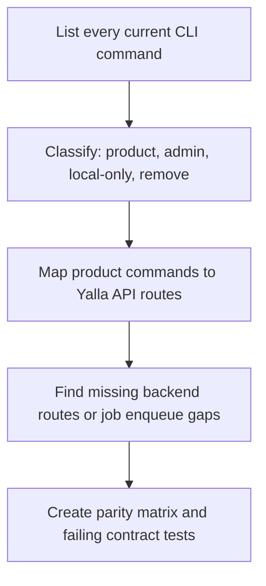

- [ ] Build a command inventory from `internal/cli` and `yalla manifest`.
- [ ] Classify every command:
  - Product command: must use Yalla backend.
  - Admin command: may use backend admin routes only.
  - Local-only command: docs, completion, config, manifest, version.
  - Remove/deprecate: raw Dokploy-only escape hatches that cannot be safely mapped.
- [ ] Create `docs/development/cli-backend-command-parity.md` with columns:
  - CLI command
  - Current Dokploy operation or local behavior
  - Target Yalla API route
  - Auth action/policy
  - Worker job type
  - Output schema
  - Migration status
- [ ] Add a static test that fails if normal CLI code imports the backend-only Dokploy client or constructs direct Dokploy operation calls.
- [ ] Add a static test that allows direct Dokploy references only in explicitly named legacy files during the migration window.

Acceptance criteria:

- Every CLI command has a target backend route or an explicit deprecation decision.
- There is a CI guard preventing new normal CLI direct-Dokploy dependencies.

## Phase 2: Define The CLI-To-Backend Client Contract

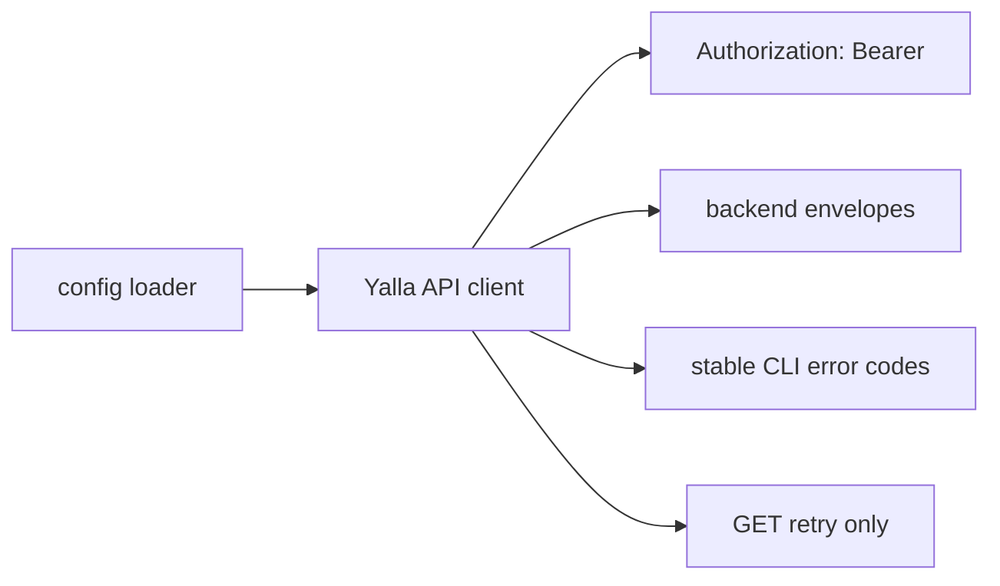

- [ ] Create a dedicated backend client package if the existing `internal/api/client.go` cannot be made terminology-neutral without confusing Dokploy and Yalla concerns.
- [ ] Use `Authorization: Bearer <token>` by default.
- [ ] Preserve CLI config precedence: flag > env > credential store > config file.
- [ ] Keep stdout for command data and stderr for errors/progress.
- [ ] Preserve redaction for token, authorization headers, request bodies containing secrets, and dry-run output.
- [ ] Normalize backend errors into existing CLI typed errors:
  - 400/422 -> invalid input
  - 401 -> auth
  - 403 -> forbidden
  - 404 -> not found
  - 409/412 -> conflict
  - 429 -> rate limited
  - 5xx -> server
- [ ] Support request IDs, correlation IDs, and trace IDs in command output or verbose diagnostics.

Acceptance criteria:

- CLI tests assert backend requests contain `Authorization` and never contain `x-api-key`.
- CLI tests assert token values never appear in human output, JSON output, errors, or dry-run output.

## Phase 3: Migrate Auth And Config First

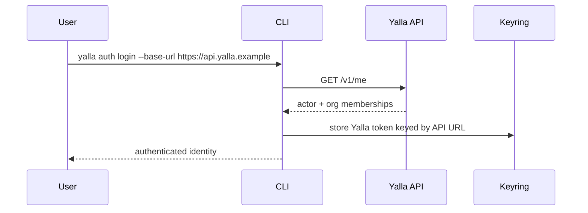

- [ ] Change CLI help text from Dokploy URL/token to Yalla API URL/token.
- [ ] Keep `YALLA_BASE_URL` and `YALLA_TOKEN` as the public env vars, but document that they now mean Yalla API base URL and Yalla API token.
- [ ] Add optional compatibility warnings if a configured URL looks like a Dokploy instance rather than a Yalla API.
- [ ] Change `auth login` verification from Dokploy `user-get` to backend `GET /v1/me`.
- [ ] Render authenticated identity from backend actor/org membership data.
- [ ] Keep keyring storage keyed by normalized backend API URL.
- [ ] Update `auth status`, `auth logout`, and config rendering to use Yalla API language.

Acceptance criteria:

- `yalla auth login` succeeds against a fake Yalla backend serving `/v1/me`.
- `yalla auth login` does not call any Dokploy route.
- `yalla auth status --json` reports backend URL and token source without leaking token.

## Phase 4: Backend Gap Closure For CLI Product Parity

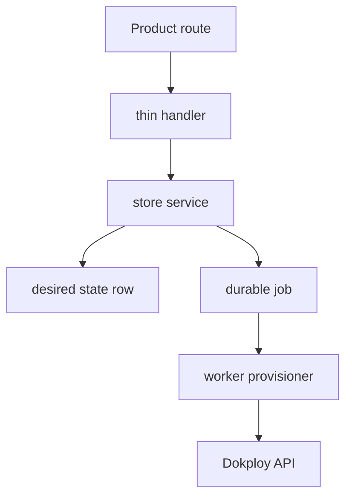

- [ ] Add or verify backend routes for all project workflows required by the CLI.
- [ ] Add or verify backend routes for all environment workflows required by the CLI.
- [ ] Add or verify backend routes for service create/update/delete/restore/rendered config.
- [ ] Add or verify backend routes for deploy/list/get/cancel/rollback.
- [ ] Add or verify backend routes for start/stop/restart.
- [ ] Add or verify backend routes for logs and metrics.
- [ ] Add or verify backend routes for domains.
- [ ] Add backup restore route coverage if CLI needs restore.
- [ ] Add first-class enqueue methods in `internal/controlplane/jobs/enqueuer.go` for job types currently only supported by the worker.
- [ ] Ensure domain changes enqueue domain reconciliation.
- [ ] Ensure variable changes enqueue variable reconciliation when the rendered runtime state changes.
- [ ] Ensure backup run/restore enqueue durable jobs and expose job IDs to CLI.
- [ ] Ensure every route has OpenAPI documentation, route registration tests, policy mapping tests, and contract tests.

Acceptance criteria:

- No CLI product command requires raw Dokploy operation coverage.
- Every mutating backend route returns enough IDs for CLI wait/progress.
- Every backend side effect is durable, idempotent, auditable, and recoverable after API process restart.

## Phase 5: Migrate CLI Product Commands

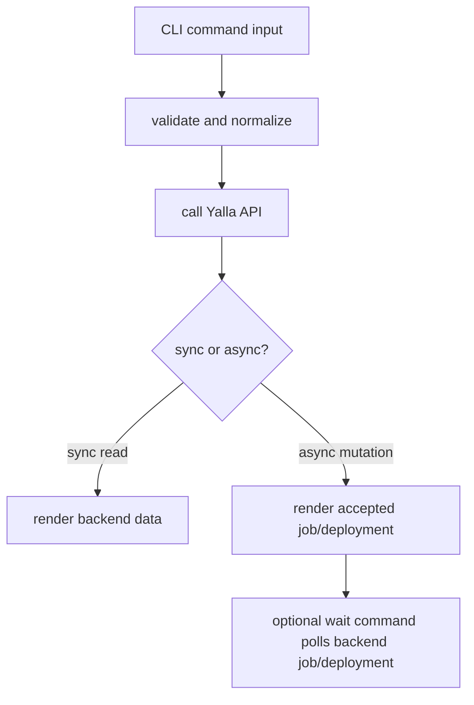

- [ ] Migrate read commands first: list/get/status/rendered/logs/metrics.
- [ ] Migrate create/update commands next: org/project/environment/service/domain/variables/backups.
- [ ] Migrate runtime commands: deploy/start/stop/restart/rollback/cancel.
- [ ] Migrate destructive commands last: delete/teardown/restore.
- [ ] For each command, update tests to use `httptest.Server` as a fake Yalla backend.
- [ ] For each command, assert request method/path/body exactly matches the Yalla API contract.
- [ ] For each command, assert successful output preserves current script-friendly JSON shape or has a documented schema bump.
- [ ] For each command, assert backend error envelopes map to existing CLI exit codes.

Acceptance criteria:

- Normal command tests fail if the CLI sends `x-api-key`.
- Normal command tests fail if the CLI calls Dokploy-style paths.
- Normal command tests pass using only fake Yalla backend responses.

## Phase 6: Replace Raw API And Schema Surfaces

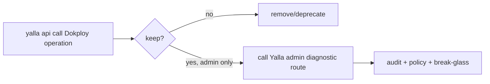

- [ ] Replace `yalla api operations` with Yalla backend OpenAPI operations.
- [ ] Replace `yalla schema get` with Yalla backend schemas.
- [ ] Remove direct `yalla api call <dokployOperation>` from normal usage.
- [ ] If an escape hatch is still required, implement `yalla admin api call` against a backend admin route with:
  - admin policy action
  - audit event
  - request redaction
  - allowlisted operations only
  - optional break-glass session requirement
- [ ] Update docs and completions to remove Dokploy operation IDs from the normal public CLI contract.

Acceptance criteria:

- The CLI no longer embeds Dokploy OpenAPI as its public command contract.
- Any raw operation escape hatch is backend-mediated, admin-only, audited, and disabled for normal users.

## Phase 7: Backend Security, Tenancy, And Observability Hardening

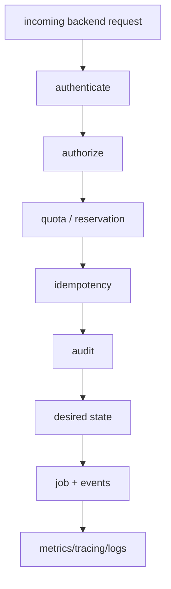

- [ ] Ensure every CLI-used route requires bearer auth unless it is intentionally public.
- [ ] Ensure every authenticated route has a policy action and resource resolver.
- [ ] Ensure every mutating route has idempotency support or a documented reason it is unsafe to replay.
- [ ] Ensure every mutating route writes an audit event.
- [ ] Ensure every quota-consuming route checks/reserves quota before enqueueing.
- [ ] Ensure backend responses include stable request/correlation IDs.
- [ ] Ensure worker job events are useful for CLI progress.
- [ ] Ensure all secrets are redacted in API logs, worker logs, CLI output, and audit metadata.

Acceptance criteria:

- Existing static tests for auth, CORS, CSRF, body size, route documentation, and policy mapping continue to pass.
- New CLI routes have coverage equivalent to frontend-used routes.

## Phase 8: Deprecation And Compatibility Window

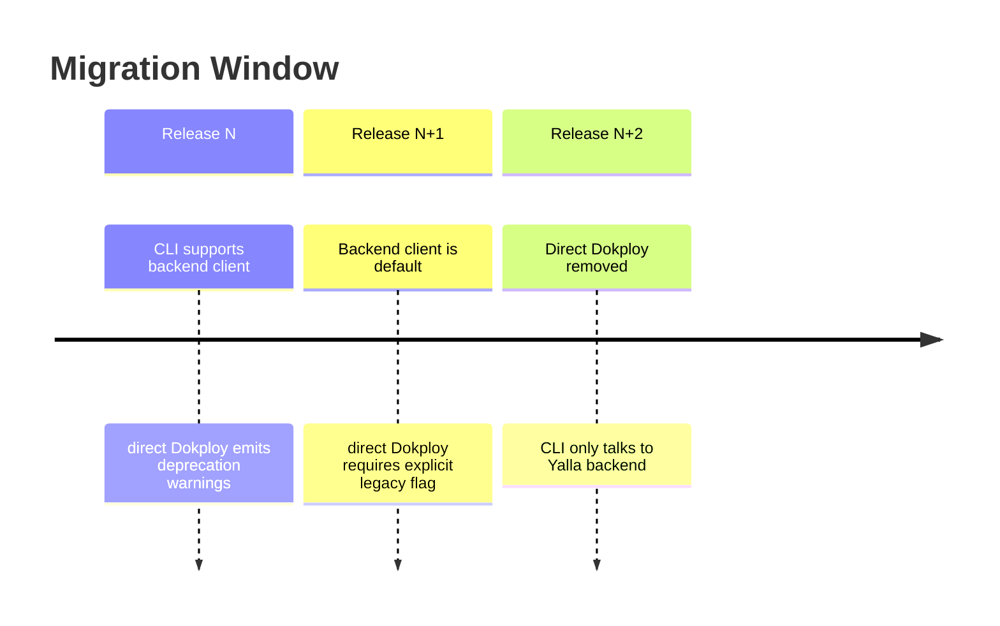

- [ ] Decide whether to ship a compatibility window or hard cutover.
- [ ] If compatibility is needed, gate legacy direct-Dokploy behavior behind explicit `YALLA_LEGACY_DOKPLOY_DIRECT=1`.
- [ ] Emit warnings only to stderr.
- [ ] Never silently convert a Dokploy token into a Yalla token.
- [ ] Provide a migration guide:
  - old config meaning
  - new config meaning
  - how to create Yalla API keys
  - how to verify login
  - command changes
  - removed raw Dokploy operations

Acceptance criteria:

- Users cannot accidentally keep using direct Dokploy after final cutover.
- CI scripts have a documented, testable migration path.

## Phase 9: End-To-End Verification

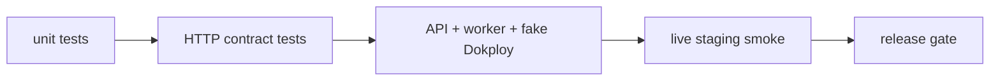

- [ ] Run CLI unit tests for config/auth/output/error handling.
- [ ] Run backend HTTP API contract tests.
- [ ] Run store tests for desired state, audit, quota, and tenant isolation.
- [ ] Run worker tests with fake Dokploy.
- [ ] Add an integration test that starts API + worker + fake Dokploy and drives the CLI against only the API.
- [ ] Add a staging smoke test:
  - create org/project/environment/service
  - deploy service
  - wait for job
  - read logs/metrics
  - add domain
  - set variables
  - run backup
  - teardown
- [ ] Add a security smoke test proving CLI cannot access Dokploy directly and backend does not expose Dokploy token.

Acceptance criteria:

- A packet/request trace during the smoke test shows CLI traffic only to Yalla API.
- Dokploy receives traffic only from the worker/backend network identity.
- All command output remains scriptable and tokens are redacted.

## Production Readiness Checklist

- [ ] CLI no longer imports normal Dokploy execution code.
- [ ] CLI no longer sends `x-api-key`.
- [ ] CLI no longer requires Dokploy base URL.
- [ ] CLI login verifies through `/v1/me`.
- [ ] CLI wait/progress uses backend jobs/deployments.
- [ ] Backend OpenAPI is the CLI schema source.
- [ ] Backend has all CLI product routes.
- [ ] Backend route docs and policy mappings pass CI.
- [ ] Mutating backend routes are idempotent/audited/quota-aware.
- [ ] Worker is the only normal Dokploy mutator.
- [ ] Worker jobs are retry-safe and evented.
- [ ] Domain/variable/backup side effects are durable jobs.
- [ ] Legacy direct-Dokploy escape hatch is removed or admin-only backend mediated.
- [ ] Docs clearly separate CLI env vars from backend/worker infrastructure env vars.

## Suggested Commit Sequence

1. `test: add cli backend-only dependency guards`
2. `docs: add cli backend command parity matrix`
3. `feat(cli): add yalla backend client transport`
4. `feat(cli): verify auth against control plane`
5. `feat(api): close cli parity route gaps`
6. `feat(worker): enqueue remaining cli side-effect jobs`
7. `feat(cli): migrate read commands to control plane`
8. `feat(cli): migrate mutation commands to control plane`
9. `feat(cli): migrate deploy and wait flows to control plane`
10. `feat(cli): replace raw dokploy api surface`
11. `docs: update cli backend-only migration guide`
12. `test: add end-to-end cli api worker fake-dokploy flow`

## Final Definition Of Done

The migration is complete only when this command-level invariant is true:

```text
For every normal user-facing yalla CLI command:
  network destination = Yalla backend API
  auth header = Authorization: Bearer <Yalla token>
  Dokploy URL/token = unavailable to CLI
  side effects = persisted by backend then executed by worker
```

And this backend invariant is true:

```text
For every Dokploy mutation:
  caller = Yalla backend worker path
  credential = private infrastructure Dokploy token
  source of truth = Postgres desired state
  control = auth + policy + quota + audit + idempotency
```
