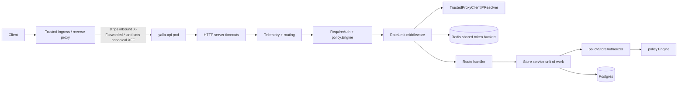
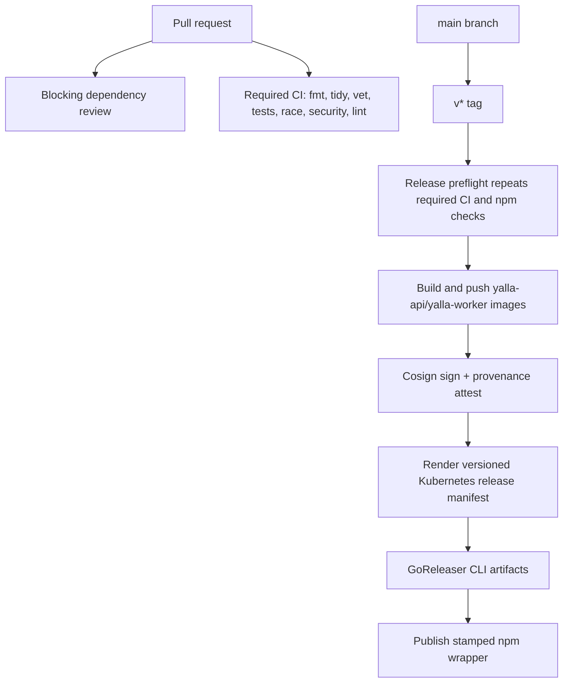
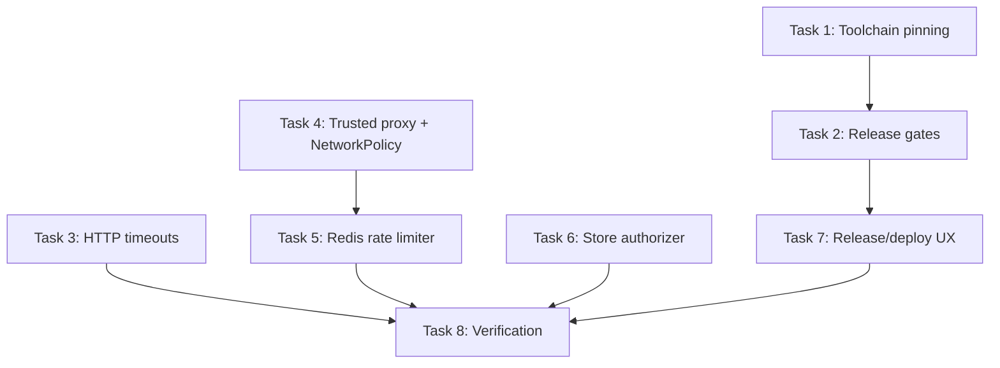

# Yalla Production Readiness Hardening Implementation Plan

> Historical implementation plan snapshot. It is kept for rationale and task
> history, not as the current CLI or API reference. Use `README.md`,
> `docs/development/cli-backend-command-parity.md`, and `yalla --json manifest`
> for the authoritative command surface.

> **For agentic workers:** REQUIRED SUB-SKILL: Use superpowers:subagent-driven-development (recommended) or superpowers:executing-plans to implement this plan task-by-task. Steps use checkbox (`- [ ]`) syntax for tracking.

**Goal:** Remove the production-readiness blockers found in the control-plane review: build determinism, release gates, HTTP timeout hardening, trusted proxy handling, distributed rate limiting, service-layer authorization, and deploy/install operator readiness.

**Architecture:** Keep the existing Go control-plane architecture and add hardening at the narrow runtime boundaries: config loading, HTTP middleware, rate-limit backend selection, store-service authorization adapters, CI/release workflow gates, and Kubernetes manifests. Production traffic should enter only through a trusted proxy, use shared Redis-backed limits across API replicas, execute policy checks in both HTTP and store layers, and ship only after release preflight proves tests, vulnerability scanning, linting, containers, npm wrapper, and deployment artifacts are valid.

**Tech Stack:** Go 1.26.3, net/http, pgx/Postgres, Redis for distributed token buckets, GitHub Actions, Docker Buildx, Cosign keyless signing, npm/node test runner, Kubernetes NetworkPolicy and Kustomize-compatible manifests.

---

## Runtime Diagram



## Release Gate Diagram



## Task Dependency Diagram



## File Structure

- Modify `Dockerfile`: align API builder image with `go.mod` toolchain.
- Modify `Dockerfile.worker`: keep worker builder in sync and update comments if needed.
- Modify `internal/controlplane/build/api_dockerfile_test.go`: assert Dockerfile `GO_VERSION` equals the toolchain expected by the repo.
- Create `internal/release/toolchain_static_test.go`: pin all Dockerfiles and GitHub Actions to `go.mod` / `toolchain`.
- Modify `.github/workflows/dependency-review.yml`: make dependency review blocking.
- Modify `.github/workflows/release.yml`: add release preflight, image build/push, signatures, provenance, and rendered manifests.
- Modify `internal/controlplane/config/config.go`: add HTTP timeout, trusted proxy, and rate-limit backend config fields/env constants.
- Modify `internal/controlplane/config/load.go`: resolve and validate the new config.
- Modify `internal/controlplane/config/config_test.go`: cover defaults, overrides, validation, and redaction.
- Modify `internal/controlplane/config/config_validation_test.go`: add new validation scenarios to the closed config-validation suite.
- Modify `cmd/yalla-api/main.go`: wire HTTP timeouts, trusted proxy resolver, Redis limiter, and real store authorizer.
- Create `cmd/yalla-api/authorizer.go`: policy-backed `store.Authorizer` adapter.
- Create `cmd/yalla-api/authorizer_test.go`: prove store authorization allows/denies through the policy engine.
- Modify `internal/controlplane/httpapi/ratelimit.go`: inject a client-IP resolver and stop trusting forwarded headers by default.
- Modify `internal/controlplane/httpapi/ratelimit_test.go`: update existing IP tests and add resolver-injection coverage.
- Modify `internal/controlplane/httpapi/ratelimit_bypass_test.go`: prove untrusted direct callers cannot spoof `X-Forwarded-For`.
- Modify `internal/controlplane/ratelimit/limiter.go`: keep in-memory limiter as local/test backend.
- Create `internal/controlplane/ratelimit/redis.go`: Redis-backed atomic limiter implementing the existing HTTP rate-limit port.
- Create `internal/controlplane/ratelimit/redis_test.go`: unit/integration coverage for atomic multi-bucket semantics.
- Modify `deploy/kubernetes/yalla-control-plane.yaml`: add strict ingress `from:` selectors, Redis env wiring, trusted proxy config, timeout env, immutable image guidance, and `imagePullPolicy: Always` or digest-based images for releases.
- Modify `deploy/kubernetes/README.md`: document ingress labels, trusted proxy CIDRs, Redis requirement, tag/digest workflow, and production verification.
- Add `npm/package-lock.json`: make `npm audit --omit=dev` possible and deterministic.

## Acceptance Criteria

- API and worker containers build with Go 1.26.3, matching `go.mod` and `toolchain go1.26.3`.
- A pull request cannot merge with high-or-worse dependency-review findings.
- A tag cannot publish CLI artifacts, npm wrapper, containers, or Kubernetes manifests unless release preflight passes.
- `yalla-api` sets positive `ReadTimeout`, `ReadHeaderTimeout`, `WriteTimeout`, and `IdleTimeout` from validated config.
- Forwarded client IP headers are honored only when `RemoteAddr` belongs to configured trusted proxy CIDRs.
- The Kubernetes API NetworkPolicy allows API ingress only from the ingress controller and explicitly trusted internal Yalla pods.
- Production/staging rate limiting is Redis-backed by default and shared across API replicas.
- Store-service `Authorizer` calls use `policy.Engine` and no production binary wires `alwaysAllowAuthorizer`.
- Release artifacts include signed container images and rendered deployment manifests with versioned image refs.
- Full verification passes in an environment with Go 1.26.3, Docker Buildx, Postgres integration URL, and Redis integration URL.

---

### Task 1: Align Go Toolchain Across Containers and Static Tests

**Files:**
- Modify: `Dockerfile`
- Modify: `Dockerfile.worker`
- Modify: `internal/controlplane/build/api_dockerfile_test.go`
- Create: `internal/release/toolchain_static_test.go`

- [ ] **Step 1: Write a failing static test for toolchain drift**

Create `internal/release/toolchain_static_test.go` with this test:

```go
package release

import (
	"os"
	"path/filepath"
	"regexp"
	"strings"
	"testing"
)

func TestContainerGoVersionsMatchModuleToolchain(t *testing.T) {
	t.Parallel()

	root := repoRoot(t)
	want := goToolchainVersion(t, filepath.Join(root, "go.mod"))
	for _, file := range []string{"Dockerfile", "Dockerfile.worker"} {
		data, err := os.ReadFile(filepath.Join(root, file))
		if err != nil {
			t.Fatalf("read %s: %v", file, err)
		}
		re := regexp.MustCompile(`(?m)^ARG\s+GO_VERSION=([^\s]+)\s*$`)
		match := re.FindStringSubmatch(string(data))
		if len(match) != 2 {
			t.Fatalf("%s must declare ARG GO_VERSION with a pinned default", file)
		}
		if match[1] != want {
			t.Fatalf("%s GO_VERSION = %q, want %q from go.mod toolchain", file, match[1], want)
		}
	}
}

func goToolchainVersion(t *testing.T, path string) string {
	t.Helper()
	data, err := os.ReadFile(path)
	if err != nil {
		t.Fatalf("read go.mod: %v", err)
	}
	for _, line := range strings.Split(string(data), "\n") {
		fields := strings.Fields(line)
		if len(fields) == 2 && fields[0] == "toolchain" {
			return strings.TrimPrefix(fields[1], "go")
		}
	}
	t.Fatal("go.mod must declare a toolchain line")
	return ""
}
```

- [ ] **Step 2: Run the failing test**

Run:

```bash
go test ./internal/release/... -run TestContainerGoVersionsMatchModuleToolchain -count=1
```

Expected before the fix: `Dockerfile GO_VERSION = "1.23", want "1.26.3"`.

- [ ] **Step 3: Update the API Dockerfile**

Change `Dockerfile`:

```dockerfile
ARG GO_VERSION=1.26.3
```

Leave `Dockerfile.worker` at `1.26.3`.

- [ ] **Step 4: Update Dockerfile static-test fixtures**

In `internal/controlplane/build/api_dockerfile_test.go` and `internal/release/container_hardening_static_test.go`, replace canonical fixture snippets that use `golang:1.23` only when the snippet is meant to represent current canonical production input. Keep intentionally bad fixtures bad only when the asserted behavior is unrelated to the Go version.

- [ ] **Step 5: Verify**

Run:

```bash
go test ./internal/controlplane/build/... ./internal/release/... -run 'TestAPIDockerfileIsProductionGrade|TestContainerGoVersionsMatchModuleToolchain|TestContainerHardening' -count=1
docker build -f Dockerfile --build-arg VERSION=0.0.0-dev --build-arg COMMIT="$(git rev-parse HEAD)" --build-arg DATE="$(date -u +%Y-%m-%dT%H:%M:%SZ)" -t yalla-api:toolchain-check .
docker build -f Dockerfile.worker --build-arg VERSION=0.0.0-dev --build-arg COMMIT="$(git rev-parse HEAD)" --build-arg DATE="$(date -u +%Y-%m-%dT%H:%M:%SZ)" -t yalla-worker:toolchain-check .
```

Expected: tests pass and both images build without downloading a different Go toolchain.

---

### Task 2: Make CI and Release Gates Blocking

**Files:**
- Modify: `.github/workflows/dependency-review.yml`
- Modify: `.github/workflows/release.yml`
- Modify: `CONTRIBUTING.md` if it documents dependency-review behavior.

- [ ] **Step 1: Make dependency review actually blocking**

Edit `.github/workflows/dependency-review.yml` and remove:

```yaml
continue-on-error: true
```

Replace the surrounding comment with:

```yaml
      # This is a required security gate. Private repositories must enable
      # GitHub Dependency graph / Dependency review before branch protection
      # marks this workflow required.
```

- [ ] **Step 2: Add a release preflight job**

In `.github/workflows/release.yml`, add a `preflight` job before `release`:

```yaml
  preflight:
    name: Release preflight
    runs-on: ubuntu-latest
    steps:
      - name: Checkout
        uses: actions/checkout@v4
        with:
          fetch-depth: 0

      - name: Set up Go
        uses: actions/setup-go@v5
        with:
          go-version-file: go.mod
          cache: true

      - name: Verify go mod tidy is clean
        run: |
          go mod tidy
          git diff --exit-code -- go.mod go.sum

      - name: gofmt
        run: |
          test -z "$(gofmt -l .)"

      - name: go vet
        run: go vet ./...

      - name: Go tests
        run: go test ./...

      - name: Race detector
        run: go test -race ./...

      - name: govulncheck
        run: |
          go install golang.org/x/vuln/cmd/govulncheck@latest
          govulncheck ./...

      - name: staticcheck
        run: |
          go install honnef.co/go/tools/cmd/staticcheck@latest
          staticcheck ./...

      - name: golangci-lint
        uses: golangci/golangci-lint-action@v7
        with:
          version: v2.12.2
          args: --timeout=5m

      - name: Set up Node
        uses: actions/setup-node@v4
        with:
          node-version: "24"

      - name: npm tests
        working-directory: npm
        run: npm test

      - name: npm audit
        working-directory: npm
        run: npm audit --omit=dev
```

- [ ] **Step 3: Make publishing depend on preflight**

Change the release job:

```yaml
  release:
    name: GoReleaser
    runs-on: ubuntu-latest
    needs: preflight
```

Keep `npm-publish` depending on `release`.

- [ ] **Step 4: Verify workflow syntax**

Run:

```bash
git diff --check .github/workflows/dependency-review.yml .github/workflows/release.yml
```

Expected: no whitespace errors. In CI, a tag push must show `preflight` completing before `release`.

---

### Task 3: Add Validated HTTP Server Timeouts

**Files:**
- Modify: `internal/controlplane/config/config.go`
- Modify: `internal/controlplane/config/load.go`
- Modify: `internal/controlplane/config/config_test.go`
- Modify: `internal/controlplane/config/config_validation_test.go`
- Modify: `cmd/yalla-api/main.go`
- Modify: `SECURITY.md`

- [ ] **Step 1: Add failing config tests**

Add tests to `internal/controlplane/config/config_test.go`:

```go
func TestHTTPTimeoutDefaultsAndOverrides(t *testing.T) {
	t.Parallel()

	cfg, err := Load(MapLookup(strictEnv()))
	if err != nil {
		t.Fatalf("Load strict env: %v", err)
	}
	if cfg.HTTPReadTimeout != 15*time.Second {
		t.Errorf("HTTPReadTimeout = %s, want 15s", cfg.HTTPReadTimeout)
	}
	if cfg.HTTPWriteTimeout != 60*time.Second {
		t.Errorf("HTTPWriteTimeout = %s, want 60s", cfg.HTTPWriteTimeout)
	}
	if cfg.HTTPIdleTimeout != 120*time.Second {
		t.Errorf("HTTPIdleTimeout = %s, want 120s", cfg.HTTPIdleTimeout)
	}

	env := strictEnv()
	env[EnvHTTPReadTimeout] = "20s"
	env[EnvHTTPWriteTimeout] = "90s"
	env[EnvHTTPIdleTimeout] = "3m"
	cfg, err = Load(MapLookup(env))
	if err != nil {
		t.Fatalf("Load overridden env: %v", err)
	}
	if cfg.HTTPReadTimeout != 20*time.Second || cfg.HTTPWriteTimeout != 90*time.Second || cfg.HTTPIdleTimeout != 3*time.Minute {
		t.Fatalf("HTTP timeouts = %s/%s/%s, want 20s/90s/3m", cfg.HTTPReadTimeout, cfg.HTTPWriteTimeout, cfg.HTTPIdleTimeout)
	}
}
```

Add validation scenarios in `buildConfigValidationScenarios()`:

```go
{
	name:    "http_read_timeout_malformed",
	mutate:  func(e map[string]string) { e[EnvHTTPReadTimeout] = "soon" },
	wantSub: EnvHTTPReadTimeout,
},
{
	name:    "http_write_timeout_too_small",
	mutate:  func(e map[string]string) { e[EnvHTTPWriteTimeout] = "0s" },
	wantSub: EnvHTTPWriteTimeout,
},
{
	name:    "http_idle_timeout_too_large",
	mutate:  func(e map[string]string) { e[EnvHTTPIdleTimeout] = "30m" },
	wantSub: EnvHTTPIdleTimeout,
},
```

- [ ] **Step 2: Run the failing tests**

Run:

```bash
go test ./internal/controlplane/config/... -run 'TestHTTPTimeoutDefaultsAndOverrides|TestConfigValidation' -count=1
```

Expected before implementation: compile errors for missing `EnvHTTPReadTimeout` and config fields.

- [ ] **Step 3: Add config fields and env constants**

In `internal/controlplane/config/config.go`, add constants:

```go
EnvHTTPReadTimeout  = "YALLA_HTTP_READ_TIMEOUT"
EnvHTTPWriteTimeout = "YALLA_HTTP_WRITE_TIMEOUT"
EnvHTTPIdleTimeout  = "YALLA_HTTP_IDLE_TIMEOUT"
```

Add fields to `Config`:

```go
HTTPReadTimeout  time.Duration
HTTPWriteTimeout time.Duration
HTTPIdleTimeout  time.Duration
```

Add them to `RedactedConfig` as strings:

```go
HTTPReadTimeout  string `json:"http_read_timeout"`
HTTPWriteTimeout string `json:"http_write_timeout"`
HTTPIdleTimeout  string `json:"http_idle_timeout"`
```

- [ ] **Step 4: Resolve and validate timeout values**

In `internal/controlplane/config/load.go`, add defaults to `profileDefaults`:

```go
httpReadTimeout  time.Duration
httpWriteTimeout time.Duration
httpIdleTimeout  time.Duration
```

Use these profile defaults:

```go
httpReadTimeout:  15 * time.Second,
httpWriteTimeout: 60 * time.Second,
httpIdleTimeout:  120 * time.Second,
```

For `ProfileTest`, use:

```go
httpReadTimeout:  2 * time.Second,
httpWriteTimeout: 5 * time.Second,
httpIdleTimeout:  10 * time.Second,
```

Resolve with `resolveDuration`, then validate:

```go
const (
	minHTTPTimeout = time.Second
	maxHTTPTimeout = 5 * time.Minute
)

func validateHTTPTimeout(env string, d time.Duration) error {
	if d < minHTTPTimeout || d > maxHTTPTimeout {
		return yerr.Newf(yerr.CodeConfig, "%s %s is out of range (want between %s and %s)", env, d, minHTTPTimeout, maxHTTPTimeout)
	}
	return nil
}
```

- [ ] **Step 5: Wire the server fields**

In `cmd/yalla-api/main.go`, update the server literal:

```go
server := &http.Server{
	Addr:              cfg.APIAddr,
	Handler:           httpapi.NewHandler(...),
	ReadHeaderTimeout: 10 * time.Second,
	ReadTimeout:       cfg.HTTPReadTimeout,
	WriteTimeout:      cfg.HTTPWriteTimeout,
	IdleTimeout:       cfg.HTTPIdleTimeout,
}
```

- [ ] **Step 6: Verify**

Run:

```bash
go test ./internal/controlplane/config/... ./cmd/yalla-api/... -run 'TestHTTPTimeoutDefaultsAndOverrides|TestConfigValidation|TestMain' -count=1
go test ./internal/release/... -run TestHTTPServerHardening -count=1
```

Expected: config tests pass and static hardening tests still pass.

---

### Task 4: Trust Forwarded IP Headers Only From Trusted Proxies

**Files:**
- Modify: `internal/controlplane/config/config.go`
- Modify: `internal/controlplane/config/load.go`
- Modify: `internal/controlplane/config/config_test.go`
- Modify: `internal/controlplane/httpapi/ratelimit.go`
- Modify: `internal/controlplane/httpapi/ratelimit_test.go`
- Modify: `internal/controlplane/httpapi/ratelimit_bypass_test.go`
- Modify: `internal/controlplane/httpapi/server.go`
- Modify: `cmd/yalla-api/main.go`
- Modify: `deploy/kubernetes/yalla-control-plane.yaml`
- Modify: `SECURITY.md`

- [ ] **Step 1: Add failing HTTP tests**

Add to `internal/controlplane/httpapi/ratelimit_bypass_test.go`:

```go
func TestClientIPIgnoresForwardedHeadersFromUntrustedRemote(t *testing.T) {
	t.Parallel()

	req := httptest.NewRequest(http.MethodGet, "/v1/projects", nil)
	req.RemoteAddr = "198.51.100.10:45678"
	req.Header.Set("X-Forwarded-For", "203.0.113.99")

	resolver := NewTrustedProxyClientIPResolver(nil)
	if got := resolver(req); got != "198.51.100.10" {
		t.Fatalf("resolver = %q, want remote addr when proxy is untrusted", got)
	}
}

func TestClientIPHonoursForwardedHeadersFromTrustedProxy(t *testing.T) {
	t.Parallel()

	prefix := netip.MustParsePrefix("10.42.0.0/16")
	req := httptest.NewRequest(http.MethodGet, "/v1/projects", nil)
	req.RemoteAddr = "10.42.5.7:45678"
	req.Header.Set("X-Forwarded-For", "203.0.113.99, 10.42.5.7")

	resolver := NewTrustedProxyClientIPResolver([]netip.Prefix{prefix})
	if got := resolver(req); got != "203.0.113.99" {
		t.Fatalf("resolver = %q, want first forwarded client IP", got)
	}
}
```

- [ ] **Step 2: Run failing tests**

Run:

```bash
go test ./internal/controlplane/httpapi/... -run 'TestClientIPIgnoresForwardedHeadersFromUntrustedRemote|TestClientIPHonoursForwardedHeadersFromTrustedProxy' -count=1
```

Expected before implementation: missing `NewTrustedProxyClientIPResolver`.

- [ ] **Step 3: Add trusted proxy config**

Add env constant:

```go
EnvTrustedProxyCIDRs = "YALLA_TRUSTED_PROXY_CIDRS"
```

Add `TrustedProxyCIDRs []netip.Prefix` to `config.Config`. The loader should parse a comma-separated list, trim whitespace, reject invalid CIDRs, and default to an empty list. Empty means "do not trust forwarded IP headers."

- [ ] **Step 4: Implement the resolver**

In `internal/controlplane/httpapi/ratelimit.go`, add:

```go
type ClientIPResolver func(*http.Request) string

func NewTrustedProxyClientIPResolver(trusted []netip.Prefix) ClientIPResolver {
	return func(r *http.Request) string {
		remote := remoteAddrIP(r.RemoteAddr)
		if remote.IsValid() && remoteInPrefixes(remote, trusted) {
			if ip := firstForwardedIP(r.Header.Get("X-Forwarded-For")); ip != "" {
				return ip
			}
			if ip := validHeaderIP(r.Header.Get("X-Real-IP")); ip != "" {
				return ip
			}
		}
		if remote.IsValid() {
			return remote.String()
		}
		return r.RemoteAddr
	}
}
```

Keep `ClientIP(r)` as the safe default that uses `RemoteAddr` only. Add `RateLimitWithClientIPResolver(limiter, logger, resolver)` and have existing `RateLimit(limiter, logger)` delegate to it with `ClientIP`.

- [ ] **Step 5: Pass resolver through the route option list**

In `internal/controlplane/httpapi/server.go`, add a route option case:

```go
clientIPResolver := ClientIP
...
case ClientIPResolver:
	if v != nil {
		clientIPResolver = v
	}
...
rateLimit := RateLimitWithClientIPResolver(rateLimiter, logger, clientIPResolver)
```

In `cmd/yalla-api/main.go`, pass:

```go
httpapi.NewTrustedProxyClientIPResolver(cfg.TrustedProxyCIDRs)
```

as a route option in the `httpapi.NewHandler(...)` call.

- [ ] **Step 6: Restrict Kubernetes API ingress**

Change the `yalla-api-ingress` NetworkPolicy to:

```yaml
  ingress:
    - from:
        - namespaceSelector:
            matchLabels:
              kubernetes.io/metadata.name: ingress-nginx
          podSelector:
            matchLabels:
              app.kubernetes.io/name: ingress-nginx
        - podSelector:
            matchLabels:
              app.kubernetes.io/name: yalla-worker
              app.kubernetes.io/component: worker
      ports:
        - port: http
          protocol: TCP
```

Add `YALLA_TRUSTED_PROXY_CIDRS` to the ConfigMap with an example value that operators must replace:

```yaml
  YALLA_TRUSTED_PROXY_CIDRS: 10.42.0.0/16
```

- [ ] **Step 7: Verify**

Run:

```bash
go test ./internal/controlplane/config/... ./internal/controlplane/httpapi/... -run 'TestClientIP|TestRateLimitBypassResistance|TestConfigValidation' -count=1
kubectl apply --dry-run=client -f deploy/kubernetes/yalla-control-plane.yaml
```

Expected: forged `X-Forwarded-For` is ignored unless the remote peer is trusted.

---

### Task 5: Add Redis-Backed Distributed Rate Limiting for Production

**Files:**
- Modify: `go.mod`
- Modify: `go.sum`
- Modify: `internal/controlplane/config/config.go`
- Modify: `internal/controlplane/config/load.go`
- Modify: `internal/controlplane/config/config_test.go`
- Modify: `internal/controlplane/config/config_validation_test.go`
- Create: `internal/controlplane/ratelimit/redis.go`
- Create: `internal/controlplane/ratelimit/redis_test.go`
- Modify: `cmd/yalla-api/main.go`
- Modify: `deploy/kubernetes/yalla-control-plane.yaml`
- Modify: `deploy/kubernetes/README.md`

- [ ] **Step 1: Add failing config tests for backend selection**

Add tests:

```go
func TestRateLimitBackendDefaults(t *testing.T) {
	t.Parallel()

	env := strictEnv()
	cfg, err := Load(MapLookup(env))
	if err == nil {
		t.Fatal("production rate limiting without Redis URL succeeded, want config error")
	}

	env[EnvRateLimitRedisURL] = "redis://redis.internal:6379/0"
	cfg, err = Load(MapLookup(env))
	if err != nil {
		t.Fatalf("Load with Redis URL: %v", err)
	}
	if cfg.RateLimit.Backend != RateLimitBackendRedis {
		t.Fatalf("backend = %q, want redis", cfg.RateLimit.Backend)
	}
}
```

- [ ] **Step 2: Add backend config**

Add:

```go
const (
	EnvRateLimitBackend      = "YALLA_RATE_LIMIT_BACKEND"
	EnvRateLimitRedisURL     = "YALLA_RATE_LIMIT_REDIS_URL"
	EnvRateLimitRedisPrefix  = "YALLA_RATE_LIMIT_REDIS_KEY_PREFIX"
	EnvRateLimitRedisTimeout = "YALLA_RATE_LIMIT_REDIS_TIMEOUT"
)

type RateLimitBackend string

const (
	RateLimitBackendMemory RateLimitBackend = "memory"
	RateLimitBackendRedis  RateLimitBackend = "redis"
)
```

Extend `RateLimit`:

```go
Backend      RateLimitBackend
RedisURL     string
RedisPrefix  string
RedisTimeout time.Duration
```

Production and staging defaults:

```go
Backend: RateLimitBackendRedis,
RedisPrefix: "yalla:ratelimit",
RedisTimeout: 250 * time.Millisecond,
```

Local default: memory. Test default: disabled.

Validation rule: if `RateLimit.AnyEnabled()` and backend is `redis`, `RedisURL` must be non-empty and parse as `redis://` or `rediss://`.

- [ ] **Step 3: Add Redis dependency**

Run:

```bash
go get github.com/redis/go-redis/v9@latest
go get github.com/alicebob/miniredis/v2@latest
go mod tidy
```

- [ ] **Step 4: Implement Redis limiter**

Create `internal/controlplane/ratelimit/redis.go` with:

```go
type RedisClient interface {
	Eval(ctx context.Context, script string, keys []string, args ...any) *redis.Cmd
	Close() error
}

type RedisLimiter struct {
	client RedisClient
	cfg    Config
	prefix string
	now    func() time.Time
}

func NewRedisLimiter(client RedisClient, cfg Config, prefix string) (*RedisLimiter, error) {
	if client == nil {
		return nil, errors.New("ratelimit: redis client is nil")
	}
	if cfg.Now == nil {
		cfg.Now = time.Now
	}
	if prefix == "" {
		prefix = "yalla:ratelimit"
	}
	return &RedisLimiter{client: client, cfg: cfg, prefix: prefix, now: cfg.Now}, nil
}
```

The Lua script must:

1. Build enabled buckets for org, key, and IP in fixed order.
2. Refill every enabled bucket from `last_ms` and `tokens`.
3. If any bucket has less than one token, return `{0, bucket_name, retry_ms}` without debiting later buckets.
4. If every bucket can allow, decrement one token from every enabled bucket and `PEXPIRE` each key.
5. Return `{1, "", 0}`.

Keep the existing no-secret contract: keys include identities, but `Decision.Bucket` returns only `organization`, `api_key`, or `ip`.

- [ ] **Step 5: Add Redis limiter tests**

In `redis_test.go`, cover:

```go
func TestRedisLimiterDeniesAcrossInstances(t *testing.T) { ... }
func TestRedisLimiterDoesNotDebitIPWhenOrgDenied(t *testing.T) { ... }
func TestRedisLimiterExemptsInternalWorker(t *testing.T) { ... }
func TestRedisLimiterDoesNotReturnBucketIdentity(t *testing.T) { ... }
```

Use two limiter instances with the same Redis server to prove cluster-wide behavior.

- [ ] **Step 6: Wire production backend**

In `cmd/yalla-api/main.go`, replace the single in-memory construction with:

```go
var httpRateLimiter httpapi.RateLimiter
if cfg.RateLimit.AnyEnabled() {
	rlCfg := rateLimitConfigFromAppConfig(cfg.RateLimit)
	switch cfg.RateLimit.Backend {
	case config.RateLimitBackendRedis:
		opt, err := redis.ParseURL(cfg.RateLimit.RedisURL)
		if err != nil {
			return err
		}
		client := redis.NewClient(opt)
		built, err := ratelimit.NewRedisLimiter(client, rlCfg, cfg.RateLimit.RedisPrefix)
		if err != nil {
			return err
		}
		defer built.Close()
		httpRateLimiter = built
	case config.RateLimitBackendMemory:
		built, err := ratelimit.New(rlCfg)
		if err != nil {
			return err
		}
		defer built.Close()
		httpRateLimiter = built
	default:
		return yerr.Newf(yerr.CodeConfig, "unsupported rate-limit backend %q", cfg.RateLimit.Backend)
	}
}
```

- [ ] **Step 7: Update Kubernetes env**

Add secret-backed Redis URL and explicit backend:

```yaml
  YALLA_RATE_LIMIT_BACKEND: redis
  YALLA_RATE_LIMIT_REDIS_KEY_PREFIX: yalla:control-plane:ratelimit
```

Add to API env:

```yaml
- name: YALLA_RATE_LIMIT_REDIS_URL
  valueFrom:
    secretKeyRef:
      name: yalla-control-plane-secrets
      key: YALLA_RATE_LIMIT_REDIS_URL
```

- [ ] **Step 8: Verify**

Run:

```bash
go test ./internal/controlplane/config/... ./internal/controlplane/ratelimit/... -run 'TestRateLimitBackend|TestRedisLimiter' -count=1
YALLA_TEST_REDIS_URL=redis://127.0.0.1:6379/15 go test ./internal/controlplane/ratelimit/... -run TestRedisLimiter -count=1
```

Expected: two limiter instances share the same denial state.

---

### Task 6: Replace `alwaysAllowAuthorizer` With Policy-Backed Store Authorization

**Files:**
- Create: `cmd/yalla-api/authorizer.go`
- Create: `cmd/yalla-api/authorizer_test.go`
- Modify: `cmd/yalla-api/main.go`
- Create or modify: `internal/release/service_authorizer_static_test.go`

- [ ] **Step 1: Add failing static test**

Create `internal/release/service_authorizer_static_test.go`:

```go
package release

import (
	"os"
	"path/filepath"
	"strings"
	"testing"
)

func TestAPIDoesNotWireAlwaysAllowAuthorizer(t *testing.T) {
	t.Parallel()

	root := repoRoot(t)
	data, err := os.ReadFile(filepath.Join(root, "cmd/yalla-api/main.go"))
	if err != nil {
		t.Fatalf("read main.go: %v", err)
	}
	if strings.Contains(string(data), "alwaysAllowAuthorizer") {
		t.Fatal("cmd/yalla-api must not wire alwaysAllowAuthorizer in production")
	}
}
```

- [ ] **Step 2: Add policy-backed adapter**

Create `cmd/yalla-api/authorizer.go`:

```go
package main

import (
	"context"
	"errors"
	"strings"

	"github.com/JuribaDev/yalla/internal/controlplane/apierr"
	"github.com/JuribaDev/yalla/internal/controlplane/domain"
	"github.com/JuribaDev/yalla/internal/controlplane/policy"
	"github.com/JuribaDev/yalla/internal/controlplane/store"
)

type policyStoreAuthorizer struct {
	engine *policy.Engine
}

func (a policyStoreAuthorizer) Authorize(ctx context.Context, _ store.Querier, action, organizationID string) error {
	if a.engine == nil {
		return apierr.Internal(errors.New("policy store authorizer requires policy engine"))
	}
	orgID := strings.TrimSpace(organizationID)
	return a.engine.AuthorizeCtx(ctx, policy.Action(strings.TrimSpace(action)), policy.Resource{
		Kind: resourceKindForAction(action),
		Scope: policy.Scope{
			OrganizationID: orgID,
		},
	})
}

func resourceKindForAction(action string) domain.Kind {
	switch {
	case strings.HasPrefix(action, "project."):
		return domain.KindProject
	case strings.HasPrefix(action, "environment."):
		return domain.KindEnvironment
	case strings.HasPrefix(action, "service."):
		return domain.KindService
	default:
		return domain.KindOrganization
	}
}
```

- [ ] **Step 3: Wire it in main**

Replace:

```go
projectAuthz := alwaysAllowAuthorizer{}
environmentAuthz := alwaysAllowAuthorizer{}
serviceAuthz := alwaysAllowAuthorizer{}
```

with:

```go
storeAuthz := policyStoreAuthorizer{engine: engine}
projectAuthz := storeAuthz
environmentAuthz := storeAuthz
serviceAuthz := storeAuthz
```

Remove the `alwaysAllowAuthorizer` type from `main.go`.

- [ ] **Step 4: Add adapter tests**

Create `cmd/yalla-api/authorizer_test.go`:

```go
package main

import (
	"context"
	"testing"

	"github.com/JuribaDev/yalla/internal/controlplane/policy"
)

func TestPolicyStoreAuthorizerAllowsOwnerProjectCreate(t *testing.T) {
	t.Parallel()

	authz := policyStoreAuthorizer{engine: policy.NewEngine()}
	ctx := policy.WithPrincipal(context.Background(), policy.Principal{
		ID:             "usr_owner",
		OrganizationID: "org_1",
		Role:           policy.RoleOwner,
	})
	if err := authz.Authorize(ctx, nil, "project.create", "org_1"); err != nil {
		t.Fatalf("Authorize returned error: %v", err)
	}
}

func TestPolicyStoreAuthorizerDeniesViewerProjectCreate(t *testing.T) {
	t.Parallel()

	authz := policyStoreAuthorizer{engine: policy.NewEngine()}
	ctx := policy.WithPrincipal(context.Background(), policy.Principal{
		ID:             "usr_viewer",
		OrganizationID: "org_1",
		Role:           policy.RoleViewer,
	})
	if err := authz.Authorize(ctx, nil, "project.create", "org_1"); err == nil {
		t.Fatal("Authorize succeeded for viewer project.create, want denial")
	}
}
```

- [ ] **Step 5: Verify**

Run:

```bash
go test ./cmd/yalla-api ./internal/release/... -run 'TestPolicyStoreAuthorizer|TestAPIDoesNotWireAlwaysAllowAuthorizer' -count=1
go test ./internal/controlplane/store/... -run 'TestProjectService|TestEnvironmentService|TestServiceService' -count=1
```

Expected: production wiring no longer contains `alwaysAllowAuthorizer`.

---

### Task 7: Make Release, Kubernetes, and npm Artifacts Operator-Ready

**Files:**
- Modify: `.github/workflows/release.yml`
- Modify: `deploy/kubernetes/yalla-control-plane.yaml`
- Modify: `deploy/kubernetes/README.md`
- Add: `deploy/kubernetes/kustomization.yaml`
- Add: `npm/package-lock.json`
- Modify: `npm/README.md`

- [ ] **Step 1: Add deterministic npm lockfile**

Run:

```bash
cd npm
npm install --package-lock-only
npm test
npm audit --omit=dev
```

Commit `npm/package-lock.json`.

- [ ] **Step 2: Add release image builds**

In `.github/workflows/release.yml`, add a job after `preflight`:

```yaml
  containers:
    name: Build and sign containers
    runs-on: ubuntu-latest
    needs: preflight
    permissions:
      contents: read
      packages: write
      id-token: write
    outputs:
      api-digest: ${{ steps.api.outputs.digest }}
      worker-digest: ${{ steps.worker.outputs.digest }}
    steps:
      - uses: actions/checkout@v4
      - uses: docker/setup-buildx-action@v3
      - uses: docker/login-action@v3
        with:
          registry: ghcr.io
          username: ${{ github.actor }}
          password: ${{ secrets.GITHUB_TOKEN }}
      - id: api
        uses: docker/build-push-action@v6
        with:
          context: .
          file: Dockerfile
          push: true
          tags: |
            ghcr.io/juribadev/yalla-api:${{ github.ref_name }}
            ghcr.io/juribadev/yalla-api:${{ github.sha }}
          build-args: |
            VERSION=${{ github.ref_name }}
            COMMIT=${{ github.sha }}
            DATE=${{ github.event.head_commit.timestamp }}
          provenance: true
          sbom: true
      - id: worker
        uses: docker/build-push-action@v6
        with:
          context: .
          file: Dockerfile.worker
          push: true
          tags: |
            ghcr.io/juribadev/yalla-worker:${{ github.ref_name }}
            ghcr.io/juribadev/yalla-worker:${{ github.sha }}
          build-args: |
            VERSION=${{ github.ref_name }}
            COMMIT=${{ github.sha }}
            DATE=${{ github.event.head_commit.timestamp }}
          provenance: true
          sbom: true
      - uses: sigstore/cosign-installer@v3
      - name: Sign images
        run: |
          cosign sign --yes "ghcr.io/juribadev/yalla-api@${{ steps.api.outputs.digest }}"
          cosign sign --yes "ghcr.io/juribadev/yalla-worker@${{ steps.worker.outputs.digest }}"
```

Change `release` to:

```yaml
needs:
  - preflight
  - containers
```

- [ ] **Step 3: Render versioned Kubernetes manifest**

Add a release step:

```yaml
      - name: Render Kubernetes manifest
        run: |
          mkdir -p dist
          cp deploy/kubernetes/yalla-control-plane.yaml dist/yalla-control-plane-${GITHUB_REF_NAME}.yaml
          sed -i "s#ghcr.io/juribadev/yalla-api:0.0.0-dev#ghcr.io/juribadev/yalla-api@${{ needs.containers.outputs.api-digest }}#g" dist/yalla-control-plane-${GITHUB_REF_NAME}.yaml
          sed -i "s#ghcr.io/juribadev/yalla-worker:0.0.0-dev#ghcr.io/juribadev/yalla-worker@${{ needs.containers.outputs.worker-digest }}#g" dist/yalla-control-plane-${GITHUB_REF_NAME}.yaml
```

Include `dist/yalla-control-plane-*.yaml` in the RustFS upload step.

- [ ] **Step 4: Add Kustomize entry point**

Create `deploy/kubernetes/kustomization.yaml`:

```yaml
apiVersion: kustomize.config.k8s.io/v1beta1
kind: Kustomization
resources:
  - yalla-control-plane.yaml
images:
  - name: ghcr.io/juribadev/yalla-api
    newTag: 0.0.0-dev
  - name: ghcr.io/juribadev/yalla-worker
    newTag: 0.0.0-dev
```

- [ ] **Step 5: Document production deploy UX**

In `deploy/kubernetes/README.md`, add exact production flow:

```bash
kustomize edit set image ghcr.io/juribadev/yalla-api=ghcr.io/juribadev/yalla-api@sha256:<api-digest>
kustomize edit set image ghcr.io/juribadev/yalla-worker=ghcr.io/juribadev/yalla-worker@sha256:<worker-digest>
kubectl apply --server-side -k deploy/kubernetes
kubectl -n yalla-control-plane rollout status deploy/yalla-api
kubectl -n yalla-control-plane rollout status deploy/yalla-worker
```

The README must say `0.0.0-dev` is a source-tree placeholder only and release manifests contain immutable digests.

- [ ] **Step 6: Verify**

Run:

```bash
cd npm && npm test && npm audit --omit=dev
cd ..
kustomize build deploy/kubernetes >/tmp/yalla-control-plane.yaml
kubectl apply --dry-run=client -f /tmp/yalla-control-plane.yaml
```

Expected: npm audit can run, Kustomize renders, Kubernetes manifest validates client-side.

---

### Task 8: End-to-End Verification and Rollout Gate

**Files:**
- Modify: `scripts/verify.sh` only if new required checks need to be included.
- Modify: `CONTRIBUTING.md`
- Modify: `SECURITY.md`

- [ ] **Step 1: Install required local verification tooling**

The verification machine must have:

```bash
go version
docker version
kubectl version --client
kustomize version
node --version
npm --version
```

Expected:

```text
go1.26.3
Docker Buildx available
Node >= 18
```

- [ ] **Step 2: Run full code verification**

Run:

```bash
scripts/verify.sh --strict
```

Expected: `gofmt`, `go mod tidy`, `go vet`, `go test ./...`, race tests, store tests, HTTP tests, OpenAPI tests, policy tests, govulncheck, staticcheck, golangci-lint, and GoReleaser check all pass.

- [ ] **Step 3: Run integration verification**

Run with real isolated services:

```bash
YALLA_TEST_DATABASE_URL=postgres://... \
YALLA_TEST_REDIS_URL=redis://127.0.0.1:6379/15 \
scripts/verify.sh --strict --with-postgres
```

Expected: database-backed store tests and Redis-backed limiter tests pass.

- [ ] **Step 4: Verify container builds**

Run:

```bash
docker build -f Dockerfile -t yalla-api:prod-check .
docker build -f Dockerfile.worker -t yalla-worker:prod-check .
docker run --rm --entrypoint /usr/local/bin/yalla-api yalla-api:prod-check --version
docker run --rm --entrypoint /usr/local/bin/yalla-worker yalla-worker:prod-check --version
```

Expected: both binaries print the injected version metadata and exit successfully.

- [ ] **Step 5: Verify Kubernetes manifests**

Run:

```bash
kustomize build deploy/kubernetes >/tmp/yalla-control-plane.yaml
kubectl apply --dry-run=client -f /tmp/yalla-control-plane.yaml
```

If a staging cluster is available:

```bash
kubectl apply --server-side --dry-run=server -f /tmp/yalla-control-plane.yaml
```

Expected: manifests validate and NetworkPolicy includes restricted `from:` selectors.

- [ ] **Step 6: Run security behavior probes in staging**

From an untrusted pod in another namespace:

```bash
curl -i -H 'X-Forwarded-For: 203.0.113.99' http://yalla-api.yalla-control-plane.svc.cluster.local:8080/openapi.json
```

Expected: request is blocked by NetworkPolicy. If temporarily allowed for testing, application uses the pod source IP, not `203.0.113.99`.

Through ingress:

```bash
curl -i -H 'X-Request-Id: prod-ready-probe' https://api.example.com/openapi.json
```

Expected: request succeeds and rate-limit logs bill the actual client IP resolved from the trusted ingress header.

- [ ] **Step 7: Run multi-replica rate-limit probe**

With two API replicas and Redis backend enabled:

```bash
for i in $(seq 1 80); do
  curl -s -o /dev/null -w '%{http_code}\n' https://api.example.com/openapi.json &
done
wait
```

Expected: 429 responses appear according to one shared configured limit, not per-pod multiplied limits. Redis keys should show a single shared prefix:

```bash
redis-cli --scan --pattern 'yalla:control-plane:ratelimit:*' | head
```

- [ ] **Step 8: Mark production readiness**

Only mark production ready when all are true:

- Required GitHub branch protection includes CI, security/lint, dependency review, and GoReleaser check.
- Release tag preflight passes.
- Containers are signed and image digests are used in release manifests.
- Production config requires Redis-backed rate limiting or explicitly disables the limiter for an approved incident.
- NetworkPolicy blocks direct pod-to-API access except ingress controller and trusted Yalla internal pods.
- Full local and CI verification artifacts are attached to the release notes.
