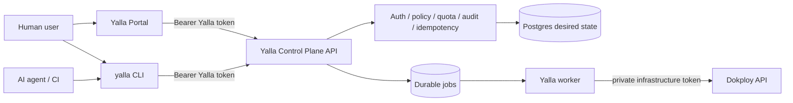
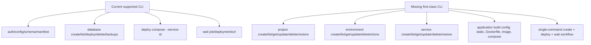
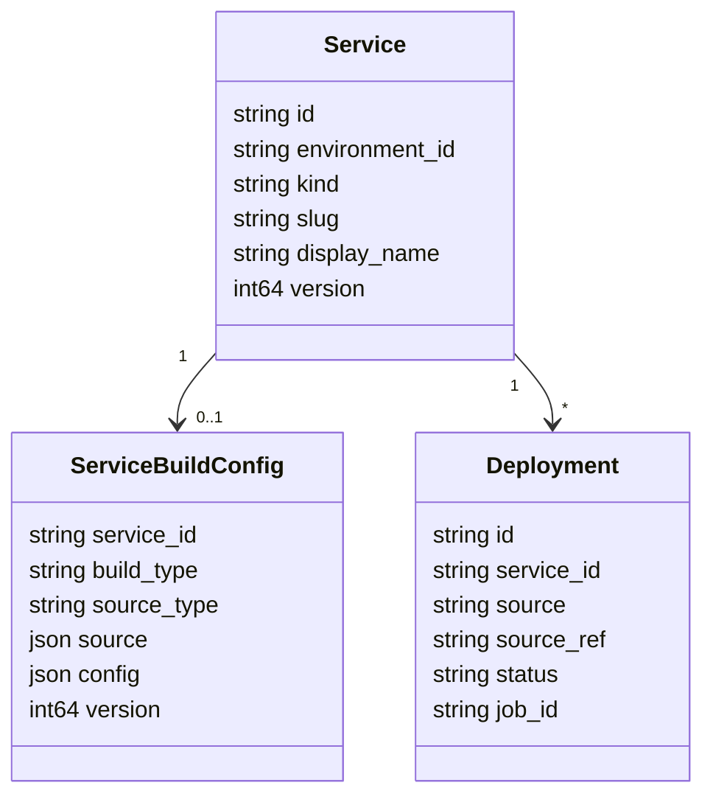
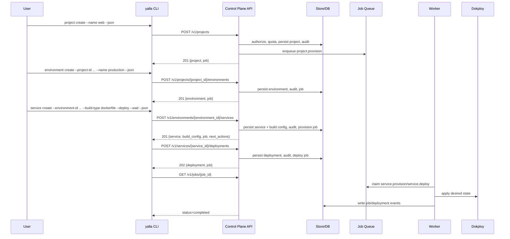

# CLI First-Class Project And Service Workflows Implementation Plan

> Historical implementation plan snapshot. It is kept for rationale and task
> history, not as the current CLI or API reference. Use `README.md`,
> `docs/development/cli-backend-command-parity.md`, and `yalla --json manifest`
> for the authoritative command surface.

> **For agentic workers:** REQUIRED SUB-SKILL: Use superpowers:subagent-driven-development (recommended) or superpowers:executing-plans to implement this plan task-by-task. Steps use checkbox (`- [ ]`) syntax for tracking.

**Goal:** Make `yalla` CLI a first-class Yalla Control Plane client for creating projects, environments, services, build configurations, deployments, and backups, with the same product contract the frontend portal uses.

**Architecture:** The CLI and portal both call the Yalla Control Plane API with backend credentials; neither client talks directly to Dokploy. The API persists desired state, enforces auth/policy/quota/audit/idempotency, and enqueues durable jobs; the worker is the only normal component that maps desired state to Dokploy resources.

**Tech Stack:** Go, Cobra CLI, existing `internal/api` transport, existing `internal/cli/yalla_backend_client.go`, Yalla Control Plane HTTP API in `internal/controlplane/httpapi`, Postgres-backed store services in `internal/controlplane/store`, durable jobs in `internal/controlplane/jobs`, worker provisioning in `internal/controlplane/worker`.

---

## Product Direction

Users must be able to create and deploy from either surface:

- Portal: click-based project, environment, service, deploy, backup flows.
- CLI: scriptable and AI-agent-friendly flows using the same backend API.
- CI/agents: deterministic commands with stable JSON output, idempotency keys, and waitable job/deployment IDs.

The CLI should not be a thin raw-HTTP escape hatch. It should expose product commands that are discoverable, typed, documented, and safe for repeated automated execution.



## Current Gap

Backend-only migration removed direct Dokploy execution from the CLI, which is correct. The remaining product gap is that normal CLI users still cannot do the full portal flow end-to-end:



Users should create projects from both the portal and the CLI. The source of truth is not the portal; the source of truth is the Yalla Control Plane API.

## Target Command Taxonomy

Canonical commands:

```text
yalla project list
yalla project get --project-id proj_...
yalla project create --name web --display-name "Web" [--project-id proj_...] [--json]
yalla project update --project-id proj_... [--name web-api] [--display-name "Web API"] [--if-match 3]
yalla project delete --project-id proj_... [--if-match 3] [--wait]
yalla project restore --project-id proj_... [--if-match 4] [--wait]

yalla environment list --project-id proj_...
yalla environment get --environment-id env_...
yalla environment create --project-id proj_... --name production [--kind standard] [--environment-id env_...]
yalla environment update --environment-id env_... [--name prod] [--display-name "Production"] [--if-match 2]
yalla environment delete --environment-id env_... [--if-match 2] [--wait]
yalla environment clone --environment-id env_... --name pr-42 [--kind preview] [--environment-id env_...]

yalla service list --environment-id env_... [--kind application|compose|database]
yalla service get --service-id svc_...
yalla service create --environment-id env_... --name web --kind application --build-type static ...
yalla service create --environment-id env_... --name api --kind application --build-type dockerfile ...
yalla service create --environment-id env_... --name stack --kind compose --build-type compose ...
yalla service create --environment-id env_... --name worker --kind application --build-type image ...
yalla service update --service-id svc_... [--name web] [--display-name "Web"] [--if-match 7]
yalla service build set --service-id svc_... --build-type dockerfile ...
yalla service deploy --service-id svc_... [--source manual] [--source-ref git_sha] [--idempotency-key key] [--wait]
yalla service delete --service-id svc_... [--if-match 7] [--wait]
yalla service restore --service-id svc_... [--if-match 8] [--wait]
```

Compatibility aliases:

- Keep `yalla deploy compose --service-id ...` as an alias to `yalla service deploy --service-id ...`.
- Keep `yalla database ...` as the database-focused UX, implemented through the same service/deployment/backup APIs.
- Do not restore raw Dokploy `api call` for normal users.

## Build Type Contract

The CLI needs a normalized build model that is stored by the backend and consumed by the worker.



Supported build types:

| Build type | CLI flags | Backend build payload | Worker behavior |
| --- | --- | --- | --- |
| `static` | `--repo`, `--branch`, `--root-dir`, `--build-command`, `--output-dir`, `--install-command`, `--spa-fallback`, `--port` | `build_type=static`, source repo/ref, build/output config | Render static site/app desired state and deploy through Dokploy app/static-compatible path |
| `dockerfile` | `--repo`, `--branch`, `--context`, `--dockerfile`, `--target`, `--build-arg KEY=VALUE`, `--port` | `build_type=dockerfile`, Dockerfile config | Render application service using Dockerfile build settings |
| `compose` | `--compose-file`, `--env-file`, `--project-name`, `--compose-service`, `--repo`, `--branch` | `build_type=compose`, compose source/config | Render compose stack desired state |
| `image` | `--image`, `--port`, `--registry-secret-ref`, `--command`, `--args` | `build_type=image`, image runtime config | Render application service from prebuilt image |

Database service creation remains `kind=database` and keeps the existing `yalla database` UX. Backups are already backend-mediated and should be exposed in the manifest alongside service commands.

## End-To-End Flow



## AI-Agent-First UX Rules

Every new CLI command must support automated use:

- `--json` returns a stable object, never human prose.
- Mutating commands accept `--idempotency-key`; commands generate one only when omitted.
- Create commands accept explicit IDs (`--project-id`, `--environment-id`, `--service-id`) so agents can make deterministic retry-safe workflows.
- Commands that enqueue work accept `--wait`, `--timeout`, and `--poll-interval`.
- Commands return backend `request_id`, `correlation_id`, `job_id`, `deployment_id`, and `next_actions` when available.
- Commands validate required flags locally and produce one concrete hint.
- `--from-file yalla.service.yaml` is supported for service creation/build config so agents can generate one typed file and call one command.
- `manifest` exposes every command, flag, output schema, OpenAPI operationId, examples, and whether the command is safe to retry.
- No normal command accepts `--dokploy-url`, `--dokploy-token`, or emits `x-api-key`.

Example machine flow:

```bash
yalla project create --project-id proj_acme_web --name acme-web --json
yalla environment create --environment-id env_acme_web_prod --project-id proj_acme_web --name production --json
yalla service create \
  --service-id svc_acme_web \
  --environment-id env_acme_web_prod \
  --name web \
  --kind application \
  --build-type dockerfile \
  --repo https://github.com/acme/web \
  --branch main \
  --context . \
  --dockerfile Dockerfile \
  --port 3000 \
  --deploy \
  --wait \
  --json
```

## File Responsibility Map

### CLI

- Create `internal/cli/project_cmd.go`: `project list/get/create/update/delete/restore`.
- Create `internal/cli/environment_cmd.go`: `environment list/get/create/update/delete/clone`.
- Create `internal/cli/service_cmd.go`: `service list/get/create/update/delete/restore`, `service deploy`, `service build get/set`.
- Create `internal/cli/service_build_payload.go`: flag normalization and `--from-file` parsing for build configs.
- Modify `internal/cli/deploy_cmd.go`: keep compatibility aliases and route to service deployment helper.
- Modify `internal/cli/database_cmd.go`: reuse shared service/deployment helpers where possible without changing the database UX.
- Modify `internal/cli/manifest_cmd.go`: include new commands, stable schemas, examples, operation IDs, retry safety.
- Modify `internal/cli/root.go`: register `project`, `environment`, and `service`.
- Test with new files:
  - `internal/cli/project_cmd_test.go`
  - `internal/cli/environment_cmd_test.go`
  - `internal/cli/service_cmd_test.go`
  - `internal/cli/service_build_payload_test.go`
  - `internal/cli/cli_first_class_manifest_test.go`

### Backend HTTP API

- Verify/extend `internal/controlplane/httpapi/projects.go` for full project CRUD/restore.
- Verify/extend `internal/controlplane/httpapi/project_environments.go` and `internal/controlplane/httpapi/environments.go` for full environment lifecycle and clone.
- Verify/extend `internal/controlplane/httpapi/environment_services.go` and `internal/controlplane/httpapi/services.go` for service lifecycle.
- Create `internal/controlplane/httpapi/service_build_configs.go`: get/set build config if build config is not embedded in service create/update.
- Modify route table in `internal/controlplane/httpapi/routes.go` with stable operation IDs:
  - `createProject`, `listProjects`, `getProject`, `updateProject`, `deleteProject`, `restoreProject`
  - `createProjectEnvironment`, `listProjectEnvironments`, `getEnvironment`, `updateEnvironment`, `deleteEnvironment`, `cloneEnvironment`
  - `createEnvironmentService`, `listEnvironmentServices`, `getService`, `updateService`, `deleteService`, `restoreService`
  - `getServiceBuildConfig`, `setServiceBuildConfig`, `createServiceDeployment`

### Store And Schema

- Create migration for `service_build_configs`:
  - `organization_id`
  - `service_id`
  - `build_type`
  - `source_type`
  - `source_json`
  - `config_json`
  - `version`
  - `created_at`, `updated_at`
  - CHECK build type in `static`, `dockerfile`, `compose`, `image`
  - foreign key to services scoped by tenant
- Create `internal/controlplane/store/service_build_config.go`: repository, validation, versioned update, tenant isolation.
- Modify `internal/controlplane/store/serviceservice.go`: create service and optional build config in one transaction; enqueue provision job after desired state is complete.
- Modify policy catalog in `internal/controlplane/policy/actions.go` and tests for `service.build.read` and `service.build.update`.
- Modify quota only if build config can materially change resource reservations; otherwise keep current service-kind quota baseline.

### Jobs And Worker

- Modify `internal/controlplane/jobs/types.go`: include `service.provision`, `service.deploy`, `service.build.update` if not already canonical.
- Modify `internal/controlplane/jobs/enqueuer.go`: add typed enqueue helpers for service provisioning/deploy/build changes.
- Modify `internal/controlplane/worker/provisioner.go`: read service + build config and dispatch by build type.
- Extend `internal/controlplane/worker/dokployfake_test.go`: fake Dokploy operations for static, Dockerfile, compose, and image services.
- Add worker tests:
  - `internal/controlplane/worker/service_build_static_test.go`
  - `internal/controlplane/worker/service_build_dockerfile_test.go`
  - `internal/controlplane/worker/service_build_compose_test.go`
  - `internal/controlplane/worker/service_build_image_test.go`

### Docs

- Modify `docs/development/cli-backend-command-parity.md`: mark new commands and backend routes.
- Modify `docs/development/frontend-handoff-api-guide.md`: document CLI/portal shared contract.
- Modify `docs/development/environment-variable-reference.md`: confirm CLI uses Yalla API credentials only.
- Modify `README.md`: add create project/environment/service/deploy examples.
- Modify `docs/curated-commands.md`: publish backend-only agent workflows.

## Task 1: Pin The CLI Contract With Failing Tests

**Files:**

- Create: `internal/cli/project_cmd_test.go`
- Create: `internal/cli/environment_cmd_test.go`
- Create: `internal/cli/service_cmd_test.go`
- Create: `internal/cli/service_build_payload_test.go`
- Modify: `internal/cli/backend_only_contract_test.go`

- [ ] Add tests that `yalla project create --project-id proj_test --name test --json` sends `POST /v1/projects` with `Authorization: Bearer` and no `x-api-key`.
- [ ] Add tests that `yalla environment create --project-id proj_test --environment-id env_test --name production --json` sends `POST /v1/projects/proj_test/environments`.
- [ ] Add tests that `yalla service create --environment-id env_test --service-id svc_web --kind application --build-type static ... --json` sends `POST /v1/environments/env_test/services` with a `build_config` payload.
- [ ] Add tests that `yalla service deploy --service-id svc_web --idempotency-key test-key --json` sends `POST /v1/services/svc_web/deployments`.
- [ ] Add tests that all mutating commands redact tokens from errors, human output, JSON output, and dry-run/verbose diagnostics.
- [ ] Run: `go test ./internal/cli -run 'Test(Project|Environment|Service|BackendOnly)' -count=1`.
- [ ] Expected before implementation: compile failure or command-not-found failures.

## Task 2: Add Project CLI Commands

**Files:**

- Create: `internal/cli/project_cmd.go`
- Modify: `internal/cli/root.go`
- Test: `internal/cli/project_cmd_test.go`

- [ ] Implement `newProjectCommand()` with `list`, `get`, `create`, `update`, `delete`, and `restore` subcommands.
- [ ] Use `newYallaAPIClient`, `yallaJSONRequest`, `yallaPath`, and `pathID`; do not create a second HTTP helper.
- [ ] Generate `project_id` with `domain.MustNewID(domain.KindProject)` when omitted.
- [ ] Accept `--if-match` on update/delete/restore and send the `If-Match` header. If the current helper cannot set custom headers, add a narrow helper in `internal/cli/yalla_backend_client.go` rather than bypassing the shared API client.
- [ ] Render backend `data` unchanged for JSON output; human output should be concise (`project created`, `project deletion accepted`).
- [ ] Register `project` in `root.go`.
- [ ] Run: `go test ./internal/cli -run TestProject -count=1`.

## Task 3: Add Environment CLI Commands

**Files:**

- Create: `internal/cli/environment_cmd.go`
- Modify: `internal/cli/root.go`
- Test: `internal/cli/environment_cmd_test.go`

- [ ] Implement `newEnvironmentCommand()` with `list`, `get`, `create`, `update`, `delete`, and `clone`.
- [ ] Map list/create to `/v1/projects/{project_id}/environments`.
- [ ] Map get/update/delete/clone to `/v1/environments/{environment_id}` and `/v1/environments/{environment_id}/clone` if the backend route exists; otherwise add the route in Task 7 before wiring the command.
- [ ] Default `--kind` to `standard`; allow `preview` only for clone/create when backend policy permits it.
- [ ] Support `--wait` on delete and clone when the response includes `job_id`.
- [ ] Register `environment` in `root.go`.
- [ ] Run: `go test ./internal/cli -run TestEnvironment -count=1`.

## Task 4: Design And Persist Service Build Configs

**Files:**

- Create: new SQL migration under the existing migration directory for `service_build_configs`.
- Create: `internal/controlplane/store/service_build_config.go`
- Create: `internal/controlplane/store/service_build_config_test.go`
- Modify: `internal/controlplane/store/serviceservice.go`
- Modify: `internal/controlplane/store/schema_test.go`

- [ ] Add a tenant-scoped `service_build_configs` table keyed by `(organization_id, service_id)`.
- [ ] Store `build_type`, `source_type`, `source_json`, `config_json`, and `version`.
- [ ] Validate build-type-specific required fields:
  - `static`: source repo or uploaded artifact reference, output directory, optional build/install commands.
  - `dockerfile`: context and Dockerfile path, optional target/build args.
  - `compose`: compose file source, optional env file and compose service.
  - `image`: image reference and optional runtime command/args.
- [ ] Enforce secret references only by reference ID; do not store raw registry passwords or environment secrets in `config_json`.
- [ ] Update `ServiceService.Create` so service and build config commit in one transaction when a build config is present.
- [ ] Add optimistic concurrency for build config updates.
- [ ] Run: `go test ./internal/controlplane/store -run 'TestServiceBuildConfig|TestServiceService' -count=1`.

## Task 5: Add Backend Build Config HTTP Contract

**Files:**

- Create: `internal/controlplane/httpapi/service_build_configs.go`
- Create: `internal/controlplane/httpapi/service_build_configs_test.go`
- Create: `internal/controlplane/httpapi/service_build_configs_policy_test.go`
- Create: `internal/controlplane/httpapi/service_build_configs_contract_test.go`
- Modify: `internal/controlplane/httpapi/routes.go`
- Modify: `internal/controlplane/httpapi/environment_services.go`
- Modify: `internal/controlplane/policy/actions.go`
- Modify: `internal/controlplane/policy/policy_test.go`

- [ ] Extend service create request to accept optional `build_config`.
- [ ] Add `GET /v1/services/{service_id}/build-config`.
- [ ] Add `PUT /v1/services/{service_id}/build-config`.
- [ ] Add policy actions `service.build.read` and `service.build.update`.
- [ ] Return stable envelopes with `data.build_config`, `version`, `request_id`, and no secrets.
- [ ] Ensure OpenAPI has operation IDs and schema examples for every build type.
- [ ] Run: `go test ./internal/controlplane/httpapi -run 'TestServiceBuild|TestEnvironmentServicesCreate|TestOpenAPI' -count=1`.

## Task 6: Add Service CLI Commands

**Files:**

- Create: `internal/cli/service_cmd.go`
- Create: `internal/cli/service_build_payload.go`
- Modify: `internal/cli/root.go`
- Modify: `internal/cli/deploy_cmd.go`
- Test: `internal/cli/service_cmd_test.go`
- Test: `internal/cli/service_build_payload_test.go`

- [ ] Implement `service list/get/create/update/delete/restore`.
- [ ] Implement `service build get` and `service build set`.
- [ ] Implement canonical `service deploy`.
- [ ] Make `deploy compose` call the same helper as `service deploy`.
- [ ] Parse build flags into one typed payload, with clear validation errors for missing build-type-specific fields.
- [ ] Add `--from-file` support for YAML/JSON service spec files. Use an existing YAML parser if already present in the module; otherwise add a small dependency deliberately and document it in the task commit.
- [ ] Support `--deploy` and `--wait` on `service create`. `--deploy` should create the service first, then call deployment route with the created service ID; `--wait` should wait on the deployment job when present.
- [ ] Run: `go test ./internal/cli -run 'TestService|TestDeploy' -count=1`.

## Task 7: Finish Environment And Service Backend Route Gaps

**Files:**

- Modify: `internal/controlplane/httpapi/environments.go`
- Modify: `internal/controlplane/httpapi/environment_services.go`
- Modify: `internal/controlplane/httpapi/services.go`
- Modify: `internal/controlplane/httpapi/routes.go`
- Add/modify tests matching any route gaps found.

- [ ] Confirm `GET /v1/environments/{environment_id}` exists and is in OpenAPI.
- [ ] Confirm `PATCH /v1/environments/{environment_id}` exists and handles `If-Match`.
- [ ] Confirm `DELETE /v1/environments/{environment_id}` exists and returns job/deletion state.
- [ ] Confirm clone route exists; if not, add `POST /v1/environments/{environment_id}/clone`.
- [ ] Confirm `GET /v1/environments/{environment_id}/services` exists and supports `kind` filtering or document CLI-side filtering as temporary.
- [ ] Confirm `GET/PATCH/DELETE/POST restore /v1/services/{service_id}` exist and are in OpenAPI.
- [ ] Run: `go test ./internal/controlplane/httpapi -run 'Test(Environment|Service)' -count=1`.

## Task 8: Worker Support For Static, Dockerfile, Compose, And Image

**Files:**

- Modify: `internal/controlplane/worker/provisioner.go`
- Modify: `internal/controlplane/worker/import_dokploy_resource.go` only if existing import/render helpers need build config awareness.
- Modify: `internal/controlplane/worker/dokployfake_test.go`
- Create worker tests for each build type.

- [ ] Add a worker lookup path that loads service, environment, project, and build config for `service.provision` and `service.deploy`.
- [ ] Add a build-type dispatch function with one branch per supported build type.
- [ ] Static branch: render build/output configuration and SPA fallback into the Dokploy-side desired state.
- [ ] Dockerfile branch: render context, Dockerfile path, optional target, build args, and port.
- [ ] Compose branch: render compose file/source and environment file references.
- [ ] Image branch: render prebuilt image, registry secret reference, command/args, and port.
- [ ] Ensure every branch is idempotent: same desired state applied twice updates/reconciles, not duplicates.
- [ ] Ensure worker events include build type and redacted source reference.
- [ ] Run: `go test ./internal/controlplane/worker -run 'TestServiceBuild|TestProvisioner' -count=1`.

## Task 9: Manifest, Docs, And Agent Workflows

**Files:**

- Modify: `internal/cli/manifest_cmd.go`
- Modify: `internal/cli/manifest_cmd_test.go`
- Modify: `docs/development/cli-backend-command-parity.md`
- Modify: `docs/development/frontend-handoff-api-guide.md`
- Modify: `docs/curated-commands.md`
- Modify: `README.md`

- [ ] Add all new commands to `yalla manifest`.
- [ ] Add examples for project, environment, service static, service Dockerfile, service compose, image service, deploy, wait, and backup.
- [ ] Add machine-readable metadata:
  - `operation_id`
  - `method`
  - `path`
  - `idempotent`
  - `supports_wait`
  - `json_output_schema`
  - `required_flags`
  - `sensitive_flags`
- [ ] Update parity doc so there is no ambiguity about where users create projects: portal and CLI both use the backend API.
- [ ] Run: `go test ./internal/cli -run TestManifest -count=1`.

## Task 10: Manual End-To-End Testing

Run against a local fake backend first, then against the provided Dokploy-backed Yalla environment only after local tests pass.

Local fake-backend checks:

- [ ] `yalla auth whoami --json`
- [ ] `yalla project create --project-id proj_manual_cli --name manual-cli --json`
- [ ] `yalla project list --json`
- [ ] `yalla project get --project-id proj_manual_cli --json`
- [ ] `yalla environment create --environment-id env_manual_cli_prod --project-id proj_manual_cli --name production --json`
- [ ] `yalla environment list --project-id proj_manual_cli --json`
- [ ] `yalla service create --service-id svc_manual_static --environment-id env_manual_cli_prod --name static --kind application --build-type static --repo https://github.com/example/static --branch main --build-command "npm run build" --output-dir dist --deploy --wait --json`
- [ ] `yalla service create --service-id svc_manual_dockerfile --environment-id env_manual_cli_prod --name api --kind application --build-type dockerfile --repo https://github.com/example/api --branch main --context . --dockerfile Dockerfile --port 8080 --deploy --wait --json`
- [ ] `yalla service create --service-id svc_manual_compose --environment-id env_manual_cli_prod --name stack --kind compose --build-type compose --compose-file docker-compose.yml --deploy --wait --json`
- [ ] `yalla service create --service-id svc_manual_image --environment-id env_manual_cli_prod --name worker --kind application --build-type image --image ghcr.io/example/worker:latest --deploy --wait --json`
- [ ] `yalla service deploy --service-id svc_manual_static --source manual --idempotency-key manual-static-1 --wait --json`
- [ ] `yalla database create --service-id svc_manual_db --environment-id env_manual_cli_prod --name postgres --deploy --json`
- [ ] `yalla database backup create --service-id svc_manual_db --display-name daily --schedule "0 2 * * *" --json`
- [ ] `yalla database backup run --service-id svc_manual_db --backup-id <backup_id> --wait --json`
- [ ] `yalla service delete --service-id svc_manual_static --wait --json`
- [ ] `yalla environment delete --environment-id env_manual_cli_prod --wait --json`
- [ ] `yalla project delete --project-id proj_manual_cli --wait --json`

Live-environment checks:

- [ ] Use `YALLA_BASE_URL=https://ploy.jsa.sa`.
- [ ] Use a Yalla backend token through `YALLA_TOKEN` or `yalla auth login`; do not add any Dokploy token flags.
- [ ] Create a uniquely named project, environment, static service, Dockerfile service, compose service, image service, and database.
- [ ] Deploy each service and verify jobs complete.
- [ ] Verify the portal sees resources created by the CLI.
- [ ] Create one resource in the portal and verify the CLI can list/get/deploy it.
- [ ] Delete/restore at least one project or service and verify job behavior.
- [ ] Confirm no CLI request sends `x-api-key` with captured backend test logs.

## Task 11: Full Verification Gate

- [ ] Run: `gofmt -w` on changed Go files.
- [ ] Run: `go test ./...`.
- [ ] Run: `go test -race ./...`.
- [ ] Run: `go vet ./...`.
- [ ] Run: `golangci-lint run ./...` if installed.
- [ ] Run: `staticcheck ./...` if installed.
- [ ] Run: `govulncheck ./...` if installed.
- [ ] Run: `goreleaser check` if release config is present.
- [ ] Run: `scripts/verify.sh`.
- [ ] Run: `git diff --check`.
- [ ] Run: `yalla manifest --json` and inspect that new commands are present.
- [ ] Run: `yalla schema list --json` and inspect that build config schemas are present.
- [ ] Repeat the manual test checklist after any verification failure fix.

## Acceptance Criteria

- A user can create a project from the CLI and see it in the portal.
- A user can create a project from the portal and manage it from the CLI.
- A user can create an environment from the CLI.
- A user can create application/compose/database services from the CLI.
- A user can configure and deploy static, Dockerfile, compose, and image services from the CLI.
- A user can create, run, restore, update, list, and delete database backups from the CLI.
- Every normal CLI operation goes through the Yalla Control Plane API using `Authorization: Bearer`.
- No normal CLI operation requires or sends a Dokploy token.
- Every mutating command is policy-checked, audited, quota/idempotency-aware where applicable, and backed by durable jobs for side effects.
- `yalla manifest` is useful enough for AI agents to choose and execute the correct command without guessing hidden flags.
- Full automated verification and manual testing pass before the work is declared complete.
