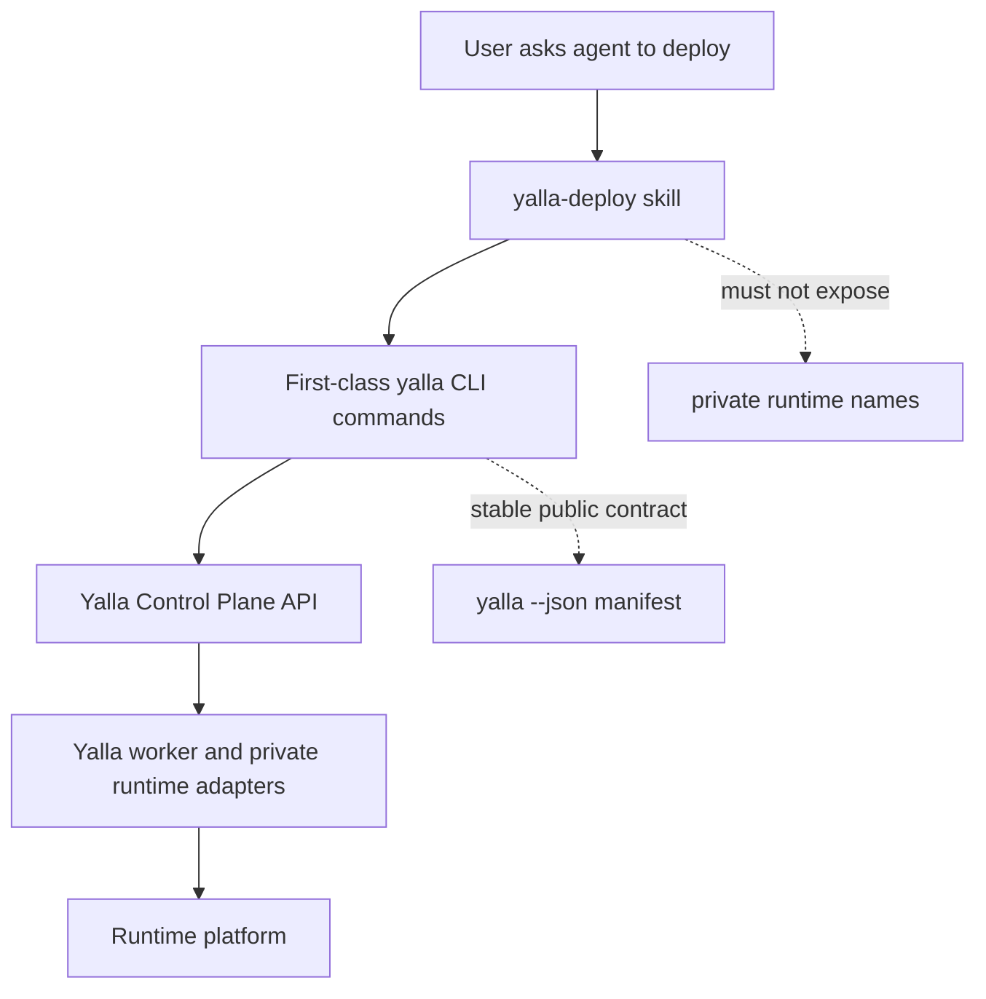
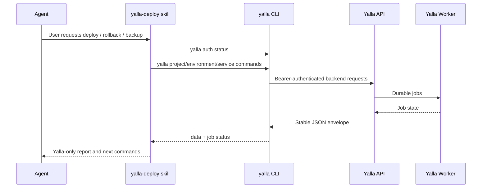

# Yalla-Only Skill Docs Implementation Plan

> Historical implementation plan snapshot. It is kept for rationale and task
> history, not as the current CLI or API reference. Use `README.md`,
> `docs/development/cli-backend-command-parity.md`, and `yalla --json manifest`
> for the authoritative command surface.

> **For agentic workers:** REQUIRED SUB-SKILL: Use superpowers:subagent-driven-development (recommended) or superpowers:executing-plans to implement this plan task-by-task. Steps use checkbox (`- [ ]`) syntax for tracking.

**Goal:** Rename and rewrite the deploy skills so the agent-facing skill surface shows only Yalla concepts and commands, while keeping general repo docs accurate about Yalla's private runtime integrations.

**Architecture:** Treat the skill as a Yalla product playbook, not a Dokploy adapter playbook. Rename the public skill directories and metadata from `yalla-dokploy-deploy` to `yalla-deploy`, rewrite all skill references around first-class `yalla project`, `yalla environment`, `yalla service`, `yalla service build`, `yalla service deploy`, and `yalla database backup` commands, and add verification that fails if any skill path or skill content still exposes Dokploy naming.

**Tech Stack:** Markdown skills, JSON evals, Bash verification scripts, `rg`, `jq`, Go CLI manifest generation.

---

## System Shape





## Scope Rules

- The `skills/` tree must not show `Dokploy`, `dokploy`, `.dokploy`, `your-dokploy`, or `yalla-dokploy-deploy` in paths or file content.
- The user-facing skill name becomes `yalla-deploy`.
- The state files become `.yalla.yaml` and `.yalla.yaml.local`.
- Skill instructions must prefer first-class Yalla commands. Raw `yalla api call ...` is allowed only in a clearly marked "unsupported edge" section if the command is still part of Yalla's public contract and the text contains no private runtime names.
- General operations docs outside `skills/` may still mention private runtime integrations where operator docs require it. This plan is strict only for `skills/`.

## File Map

**Rename:**
- `skills/codex/yalla-dokploy-deploy/` -> `skills/codex/yalla-deploy/`
- `skills/claude/yalla-dokploy-deploy/` -> `skills/claude/yalla-deploy/`

**Modify:**
- `skills/README.md`: new layout, install paths, and source-of-truth language.
- `skills/codex/README.md`: new skill name and no private runtime naming.
- `scripts/publish-skills.sh`: source/destination constants and install instructions.
- `skills/codex/yalla-deploy/SKILL.md`: Yalla-only product workflow.
- `skills/claude/yalla-deploy/SKILL.md`: Yalla-only product workflow.
- `skills/codex/yalla-deploy/agents/openai.yaml`: public skill name/description.
- `skills/*/yalla-deploy/references/*.md`: command recipes rewritten around first-class Yalla commands.
- `skills/*/yalla-deploy/evals/evals.json`: expected outputs use Yalla-only commands and wording.

**Create:**
- `scripts/verify-yalla-skills.sh`: local verification for skill naming/content and manifest command coverage.

**Optional if absent:**
- `.gitignore`: add `.yalla.yaml.local` only if this repo tracks a root ignore file and it does not already ignore local skill state.

---

### Task 1: Add Failing Skill Surface Verification

**Files:**
- Create: `scripts/verify-yalla-skills.sh`
- Modify: `scripts/verify.sh`

- [ ] **Step 1: Create the verification script**

Use `apply_patch` to add:

```bash
#!/usr/bin/env bash
set -euo pipefail

ROOT="$(cd "$(dirname "${BASH_SOURCE[0]}")/.." && pwd)"
cd "$ROOT"

fail() {
  printf 'verify-yalla-skills: %s\n' "$*" >&2
  exit 1
}

if find skills -path '*dokploy*' -print -quit | grep -q .; then
  find skills -path '*dokploy*' -print >&2
  fail "skill paths must use yalla-only names"
fi

if rg -n -i 'dokploy|\.dokploy|your-dokploy|yalla-dokploy-deploy' skills; then
  fail "skill content must not expose private runtime naming"
fi

for dir in skills/claude/yalla-deploy skills/codex/yalla-deploy; do
  [[ -f "$dir/SKILL.md" ]] || fail "missing $dir/SKILL.md"
  rg -n '^name: yalla-deploy$' "$dir/SKILL.md" >/dev/null || fail "$dir/SKILL.md must declare name: yalla-deploy"
done

manifest="$(mktemp)"
trap 'rm -f "$manifest"' EXIT

/opt/homebrew/bin/go run ./cmd/yalla --json manifest > "$manifest"

required_paths=(
  "yalla project create"
  "yalla environment create"
  "yalla service create"
  "yalla service build set"
  "yalla service deploy"
  "yalla database backup run"
  "yalla database backup restore"
)

for path in "${required_paths[@]}"; do
  jq -e --arg path "$path" '.. | objects | select(.path? == $path)' "$manifest" >/dev/null \
    || fail "manifest missing documented command: $path"
done

printf 'verify-yalla-skills: all checks passed\n'
```

- [ ] **Step 2: Make the script executable**

Run:

```bash
chmod +x scripts/verify-yalla-skills.sh
```

- [ ] **Step 3: Verify the script fails before the rename**

Run:

```bash
scripts/verify-yalla-skills.sh
```

Expected: FAIL. The output should list current `skills/*/yalla-dokploy-deploy` paths and current private runtime wording.

- [ ] **Step 4: Wire the script into full verification**

Use `apply_patch` to insert this block in `scripts/verify.sh` near the other documentation or release artifact checks:

```bash
run "verify yalla skills" scripts/verify-yalla-skills.sh
```

If `scripts/verify.sh` uses a different helper name than `run`, inspect the file and use the existing helper exactly.

- [ ] **Step 5: Commit**

```bash
git add scripts/verify-yalla-skills.sh scripts/verify.sh
git commit -m "test: enforce yalla-only skill surface"
```

---

### Task 2: Rename Public Skill Directories And Publishing Metadata

**Files:**
- Rename: `skills/codex/yalla-dokploy-deploy/` -> `skills/codex/yalla-deploy/`
- Rename: `skills/claude/yalla-dokploy-deploy/` -> `skills/claude/yalla-deploy/`
- Modify: `skills/README.md`
- Modify: `skills/codex/README.md`
- Modify: `scripts/publish-skills.sh`

- [ ] **Step 1: Rename both skill trees**

Run:

```bash
git mv skills/codex/yalla-dokploy-deploy skills/codex/yalla-deploy
git mv skills/claude/yalla-dokploy-deploy skills/claude/yalla-deploy
```

- [ ] **Step 2: Update `skills/README.md` install paths**

Replace the layout and install snippets with:

```markdown
skills/
├── claude/
│   └── yalla-deploy/
│       ├── SKILL.md
│       ├── references/
│       ├── scripts/
│       ├── fixtures/
│       └── evals/evals.json
└── codex/
    └── yalla-deploy/
        ├── SKILL.md
        ├── agents/openai.yaml
        ├── references/
        ├── scripts/
        └── evals/evals.json
```

Use these install commands:

```sh
ln -snf "$(pwd)/skills/claude/yalla-deploy" ~/.claude/skills/yalla-deploy
cp -r skills/claude/yalla-deploy ~/.claude/skills/
ln -snf "$(pwd)/skills/codex/yalla-deploy" ~/.codex/skills/yalla-deploy
```

- [ ] **Step 3: Update `skills/codex/README.md`**

Change the opening to:

```markdown
# skills/codex/

OpenAI Codex-flavored skills that pair with the yalla CLI.

This tree currently ships the Codex variant of `yalla-deploy`. It mirrors the
Claude skill's deploy references, but includes Codex-facing metadata and notes
for how Codex loads and presents skills.
```

- [ ] **Step 4: Update `scripts/publish-skills.sh` constants**

Replace the config block with:

```bash
DIST_REMOTE="https://github.com/JuribaDev/yalla-skills.git"
DIST_SLUG="JuribaDev/yalla-skills"
CLAUDE_SRC_REL="skills/claude/yalla-deploy"
CODEX_SRC_REL="skills/codex/yalla-deploy"
CLAUDE_DEST_REL="plugins/yalla-deploy/skills/yalla-deploy"
CODEX_DEST_REL="codex/yalla-deploy"
MARKETPLACE_REL=".claude-plugin/marketplace.json"
PLUGIN_JSON_REL="plugins/yalla-deploy/.claude-plugin/plugin.json"
```

Also update the release install snippet to:

```sh
/plugin marketplace add JuribaDev/yalla-skills
/plugin install yalla-deploy@yalla-skills
```

- [ ] **Step 5: Run the path check**

Run:

```bash
find skills -path '*dokploy*' -print
```

Expected: no output.

- [ ] **Step 6: Commit**

```bash
git add skills scripts/publish-skills.sh
git commit -m "chore: rename deploy skill to yalla-deploy"
```

---

### Task 3: Rewrite Skill Entry Points Around First-Class Yalla Commands

**Files:**
- Modify: `skills/codex/yalla-deploy/SKILL.md`
- Modify: `skills/claude/yalla-deploy/SKILL.md`
- Modify: `skills/codex/yalla-deploy/agents/openai.yaml`

- [ ] **Step 1: Replace the YAML front matter**

Both `SKILL.md` files must start with:

```markdown
---
name: yalla-deploy
description: Use when deploying, redeploying, promoting, rolling back, operating, scaling, backing up, restoring, or tearing down applications and services through yalla; configuring projects, environments, services, build settings, domains, env vars, migrations, volumes, notifications, preview deployments, scheduled jobs, databases, or pre-built artifact uploads.
---
```

- [ ] **Step 2: Replace the title and product summary**

Use this opening in both skill files:

```markdown
# Yalla deploy

End-to-end Yalla deployment automation. Inspect the project, plan the deployment,
get user confirmation, run first-class `yalla` commands, verify the result is
actually serving traffic, and report the stable Yalla resource IDs.

The skill assumes `yalla` is installed and authenticated against the Yalla API.
If it is not ready, follow "Pre-flight" and stop after giving setup instructions.
```

- [ ] **Step 3: Replace the intent table with Yalla-only workflows**

Use this table:

```markdown
| User intent | Workflow | Reference |
|---|---|---|
| Fresh deploy | detect -> plan -> confirm -> project -> environment -> service -> build config -> deploy -> verify -> report | `lifecycle.md` |
| Static site deploy | service create/set build config with `--build-type static` -> deploy -> verify | `build-types.md` + `lifecycle.md` |
| Dockerfile deploy | service create/set build config with `--build-type dockerfile` -> deploy -> verify | `build-types.md` + `sources.md` |
| Compose deploy | service create with `--kind compose --build-type compose` -> deploy -> verify | `lifecycle.md` |
| Image deploy | service create/set build config with `--build-type image` -> deploy -> verify | `sources.md` |
| Redeploy existing service | read `.yalla.yaml` -> `yalla service deploy --wait` -> verify | `lifecycle.md` |
| Promote staging to production | mirror build config and source into the target environment -> deploy target service -> verify | `promotion.md` |
| Rollback | set previous image/tag/commit in the Yalla build config -> deploy -> verify | `rollback.md` |
| Stop / start / restart / logs | use Yalla service operation/status/log commands when available; otherwise stop and report the missing command | `operations.md` |
| Tear down | `yalla project delete --project-id <id> --wait` after explicit confirmation | `lifecycle.md` |
| Database backup or restore | `yalla database backup run --wait` or `yalla database backup restore --wait` | `databases.md` |
```

- [ ] **Step 4: Replace pre-flight setup wording**

Use this setup snippet:

```markdown
```sh
yalla --version
yalla --json auth status
yalla --json auth whoami
```

If `yalla` is missing or `ready` is false, stop and tell the user:

```sh
cd /path/to/yalla-repo && /opt/homebrew/bin/go build -o ~/.local/bin/yalla ./cmd/yalla
printf '%s' "$YALLA_TOKEN" | yalla auth login --url https://your-yalla-api.example.com --token-stdin --json
yalla --json auth status
```
```

- [ ] **Step 5: Replace the default plan example**

Use first-class commands only:

```markdown
Yalla commands in order:
  1. yalla project create --project-id <project_id> --name <project_name> --json
  2. yalla environment create --environment-id <environment_id> --project-id <project_id> --name <environment_name> --json
  3. yalla service create --service-id <service_id> --environment-id <environment_id> --name <service_name> --kind <application|compose> --build-type <static|dockerfile|compose|image> ... --json
  4. yalla service deploy --service-id <service_id> --wait --json
  5. yalla database backup run --service-id <database_service_id> --backup-id <backup_id> --wait --json
```

- [ ] **Step 6: Replace report examples**

Use:

```markdown
Yalla deployment complete
URL:            https://<host>
Project ID:     <project_id>
Environment ID: <environment_id>
Service ID:     <service_id>
Final job:      <job_id> succeeded

Redeploy:       yalla service deploy --service-id <service_id> --wait --json
Tear down:      yalla project delete --project-id <project_id> --wait --json
Backup:         yalla database backup run --service-id <database_service_id> --backup-id <backup_id> --wait --json
```

- [ ] **Step 7: Update Codex agent metadata**

Open `skills/codex/yalla-deploy/agents/openai.yaml` and replace public title/description fields with Yalla-only wording. If the file has a `name`, `title`, or `description`, use:

```yaml
name: yalla-deploy
title: Yalla Deploy
description: Deploy and operate projects, environments, services, builds, databases, backups, and rollbacks through the yalla CLI.
```

Preserve any runtime-specific fields unrelated to naming.

- [ ] **Step 8: Run the content check**

Run:

```bash
rg -n -i 'dokploy|\.dokploy|your-dokploy|yalla-dokploy-deploy|application-|project-create|environment-create|application-deploy|project-remove' skills/*/yalla-deploy/SKILL.md skills/codex/yalla-deploy/agents/openai.yaml
```

Expected: no output.

- [ ] **Step 9: Commit**

```bash
git add skills
git commit -m "docs: rewrite skill entry points for yalla"
```

---

### Task 4: Rewrite References To Match The New CLI Contract

**Files:**
- Modify: `skills/claude/yalla-deploy/references/build-types.md`
- Modify: `skills/claude/yalla-deploy/references/composite-verbs.md`
- Modify: `skills/claude/yalla-deploy/references/databases.md`
- Modify: `skills/claude/yalla-deploy/references/detect.md`
- Modify: `skills/claude/yalla-deploy/references/drop-deploy.md`
- Modify: `skills/claude/yalla-deploy/references/lifecycle.md`
- Modify: `skills/claude/yalla-deploy/references/migrations.md`
- Modify: `skills/claude/yalla-deploy/references/mounts.md`
- Modify: `skills/claude/yalla-deploy/references/notifications.md`
- Modify: `skills/claude/yalla-deploy/references/operations.md`
- Modify: `skills/claude/yalla-deploy/references/preflight.md`
- Modify: `skills/claude/yalla-deploy/references/preview-deployments.md`
- Modify: `skills/claude/yalla-deploy/references/promotion.md`
- Modify: `skills/claude/yalla-deploy/references/rollback.md`
- Modify: `skills/claude/yalla-deploy/references/scaling.md`
- Modify: `skills/claude/yalla-deploy/references/scheduled-jobs.md`
- Modify: `skills/claude/yalla-deploy/references/sources.md`
- Modify: `skills/claude/yalla-deploy/references/verification.md`
- Mirror the same files in `skills/codex/yalla-deploy/references/`

- [ ] **Step 1: Rewrite `build-types.md` around `service build set`**

The document must contain examples for all supported build types:

```sh
yalla service build set --service-id svc_web --build-type static \
  --repo https://github.com/acme/web --branch main \
  --build-command "npm run build" --output-dir dist --json

yalla service build set --service-id svc_api --build-type dockerfile \
  --repo https://github.com/acme/api --branch main \
  --context . --dockerfile Dockerfile --port 8080 --json

yalla service build set --service-id svc_stack --build-type compose \
  --repo https://github.com/acme/stack --branch main \
  --compose-file docker-compose.yml --json

yalla service build set --service-id svc_worker --build-type image \
  --image ghcr.io/acme/worker:latest --port 8080 \
  --registry-secret-ref sec_registry --json
```

- [ ] **Step 2: Rewrite `lifecycle.md` around product resources**

The canonical fresh deploy sequence must be:

```sh
yalla project create --project-id proj_app --name app --json
yalla environment create --environment-id env_app_prod --project-id proj_app --name production --json
yalla service create --service-id svc_app_web --environment-id env_app_prod --name web --kind application --build-type dockerfile --repo https://github.com/acme/app --branch main --context . --dockerfile Dockerfile --port 3000 --json
yalla service deploy --service-id svc_app_web --wait --json
```

The state file must be:

```yaml
schema: yalla.deploy.v1
project_id: proj_app
project_name: app
environments:
  production:
    environment_id: env_app_prod
    services:
      web: svc_app_web
last_deploy:
  environment: production
  service: web
  source: https://github.com/acme/app
  ref: main
```

- [ ] **Step 3: Rewrite `databases.md`**

Use backend-mediated examples:

```sh
yalla database create postgres --environment-id env_app_prod --service-id svc_app_db --name app-db --database-name app --database-user app --database-password "$DATABASE_PASSWORD" --deploy --json
yalla database backup create --service-id svc_app_db --backup-id sbkp_daily --name daily --schedule "0 2 * * *" --json
yalla database backup run --service-id svc_app_db --backup-id sbkp_daily --wait --json
yalla database backup restore --service-id svc_app_db --backup-id sbkp_daily --wait --json
```

- [ ] **Step 4: Rewrite `sources.md`**

Use the public Yalla source model:

```markdown
| Source | Yalla build type | Primary command |
|---|---|---|
| Static build from git | `static` | `yalla service create ... --build-type static` |
| Dockerfile from git | `dockerfile` | `yalla service create ... --build-type dockerfile` |
| Compose file from git | `compose` | `yalla service create ... --kind compose --build-type compose` |
| Pre-built image | `image` | `yalla service create ... --build-type image --image ...` |
```

- [ ] **Step 5: Rewrite `verification.md`**

Use first-class wait and job polling:

```sh
yalla service deploy --service-id svc_app_web --wait --timeout 10m --json
yalla job get --job-id job_123 --json
curl -fsS https://app.example.com/healthz
```

If `yalla job get` is not available in the manifest, document the current wait-enabled commands only and add a note that raw job inspection is unavailable in this CLI build.

- [ ] **Step 6: Rewrite all unsupported-edge docs**

For `migrations.md`, `mounts.md`, `notifications.md`, `preview-deployments.md`, `scaling.md`, and `scheduled-jobs.md`, use this rule:

```markdown
If no first-class Yalla command exists for this workflow in `yalla --json manifest`, do not invent a private API operation. State the missing Yalla command, stop before mutation, and ask the user whether they want a follow-up implementation task.
```

- [ ] **Step 7: Mirror Claude references into Codex references**

After the Claude references are rewritten and reviewed, sync the shared reference content:

```bash
rsync -a --delete skills/claude/yalla-deploy/references/ skills/codex/yalla-deploy/references/
```

Then restore any Codex-only reference note if one is intentionally different.

- [ ] **Step 8: Run reference checks**

Run:

```bash
rg -n -i 'dokploy|\.dokploy|your-dokploy|yalla-dokploy-deploy|application-|project-create|environment-create|application-deploy|project-remove|compose-deploy|postgres-create|mysql-create|mongo-create|redis-create' skills/*/yalla-deploy/references
```

Expected: no output.

- [ ] **Step 9: Commit**

```bash
git add skills
git commit -m "docs: update deploy skill references for yalla commands"
```

---

### Task 5: Update Skill Evals For Yalla-Only Behavior

**Files:**
- Modify: `skills/claude/yalla-deploy/evals/evals.json`
- Modify: `skills/codex/yalla-deploy/evals/evals.json`

- [ ] **Step 1: Replace eval expected behavior**

Ensure eval assertions require:

```json
{
  "must_include": [
    "yalla project create",
    "yalla environment create",
    "yalla service create",
    "yalla service deploy --wait"
  ],
  "must_not_include": [
    "Dokploy",
    "dokploy",
    ".dokploy",
    "application-create",
    "application-deploy",
    "project-create",
    "project-remove"
  ]
}
```

Adapt the exact JSON shape to the existing eval schema; do not change the evaluator contract unless the existing file already supports a richer schema.

- [ ] **Step 2: Add coverage cases**

Add or update eval cases for:

```text
deploy a static site from GitHub
deploy a Dockerfile API
deploy a compose stack
deploy a pre-built image
run a database backup and wait
restore a database backup and wait
promote staging to production
rollback to previous image tag
```

- [ ] **Step 3: Run JSON validation**

Run:

```bash
jq empty skills/claude/yalla-deploy/evals/evals.json
jq empty skills/codex/yalla-deploy/evals/evals.json
```

Expected: no output and exit code 0.

- [ ] **Step 4: Commit**

```bash
git add skills/*/yalla-deploy/evals/evals.json
git commit -m "test: align skill evals with yalla-only workflows"
```

---

### Task 6: Update Packaging And README Verification

**Files:**
- Modify: `skills/README.md`
- Modify: `skills/codex/README.md`
- Modify: `scripts/publish-skills.sh`

- [ ] **Step 1: Run publish dry-run**

Run:

```bash
scripts/publish-skills.sh --repo ../yalla-skills
```

If `../yalla-skills` does not exist, run:

```bash
scripts/publish-skills.sh
```

Expected: dry-run completes and shows `yalla-deploy` destination paths. It must not print old skill names.

- [ ] **Step 2: Check distribution strings**

Run:

```bash
rg -n -i 'yalla-dokploy-deploy|dokploy' scripts/publish-skills.sh skills/README.md skills/codex/README.md
```

Expected: no output.

- [ ] **Step 3: Commit**

```bash
git add skills/README.md skills/codex/README.md scripts/publish-skills.sh
git commit -m "docs: update skill packaging docs for yalla-deploy"
```

---

### Task 7: Full Verification

**Files:**
- No expected edits unless verification finds a real issue.

- [ ] **Step 1: Run the dedicated skill verification**

```bash
scripts/verify-yalla-skills.sh
```

Expected:

```text
verify-yalla-skills: all checks passed
```

- [ ] **Step 2: Run markdown and JSON checks**

```bash
rg -n -i 'dokploy|\.dokploy|your-dokploy|yalla-dokploy-deploy' skills
jq empty skills/claude/yalla-deploy/evals/evals.json
jq empty skills/codex/yalla-deploy/evals/evals.json
```

Expected: `rg` has no output and exits 1; both `jq` commands pass.

- [ ] **Step 3: Run manifest coverage checks**

```bash
/opt/homebrew/bin/go run ./cmd/yalla --json manifest | jq -r '.. | objects | select(.path? | startswith("yalla project ") or startswith("yalla environment ") or startswith("yalla service ") or startswith("yalla database backup ")) | .path' | sort -u
```

Expected output includes:

```text
yalla database backup restore
yalla database backup run
yalla environment create
yalla project create
yalla service build set
yalla service create
yalla service deploy
```

- [ ] **Step 4: Run full repo verification**

```bash
/opt/homebrew/bin/go test ./...
/opt/homebrew/bin/go test -race ./...
/opt/homebrew/bin/go vet ./...
PATH="/opt/homebrew/bin:$PATH" scripts/verify.sh
git diff --check
```

Expected: all pass.

- [ ] **Step 5: Manual skill read-through**

Read:

```bash
sed -n '1,240p' skills/codex/yalla-deploy/SKILL.md
sed -n '1,240p' skills/claude/yalla-deploy/SKILL.md
```

Confirm manually:

```text
The skill can guide a fresh deploy using only yalla commands.
The skill can guide static, dockerfile, compose, and image builds.
The skill can guide backup run and restore with --wait.
The skill never tells the agent to ask the user for a private runtime URL.
The skill never tells the agent to write raw secrets to tracked files.
```

- [ ] **Step 6: Final commit**

```bash
git status --short
git add skills scripts docs .gitignore
git commit -m "docs: make deploy skills yalla-only"
```

Only include `.gitignore` if it changed.

---

## Rollback Plan

If the rename breaks packaging or external distribution:

```bash
git revert <commit-that-renamed-skill>
```

Then apply only the content rewrite inside the old directories as a temporary compatibility patch. This is not the preferred final state because the old path still exposes private runtime naming, but it keeps publication unblocked while the distribution repo is updated.

## Acceptance Criteria

- `find skills -path '*dokploy*' -print` returns no output.
- `rg -n -i 'dokploy|\.dokploy|your-dokploy|yalla-dokploy-deploy' skills` returns no output.
- Both skill entry points declare `name: yalla-deploy`.
- Published install snippets use `yalla-deploy`.
- Skill examples use first-class Yalla commands, not private operation IDs.
- `scripts/verify-yalla-skills.sh` passes.
- `PATH="/opt/homebrew/bin:$PATH" scripts/verify.sh` passes.

## Self-Review

- **Spec coverage:** The plan covers CLI docs already updated, remaining skill docs, skill references, evals, packaging, and verification. It explicitly handles the user's requirement that skills show only Yalla.
- **Placeholder scan:** No task contains "TBD", "TODO", or "implement later". Unsupported workflows are handled by a concrete stop-and-report rule.
- **Type consistency:** The skill name is consistently `yalla-deploy`; state files are consistently `.yalla.yaml` / `.yalla.yaml.local`; command examples match the implemented first-class CLI surface.
